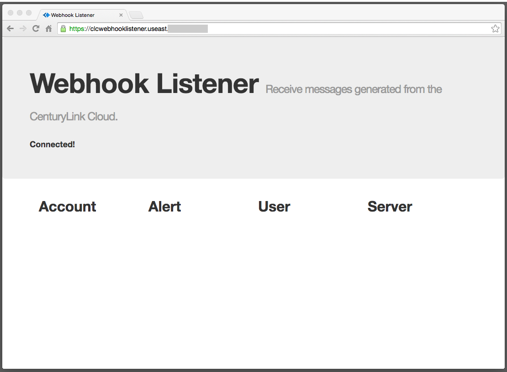
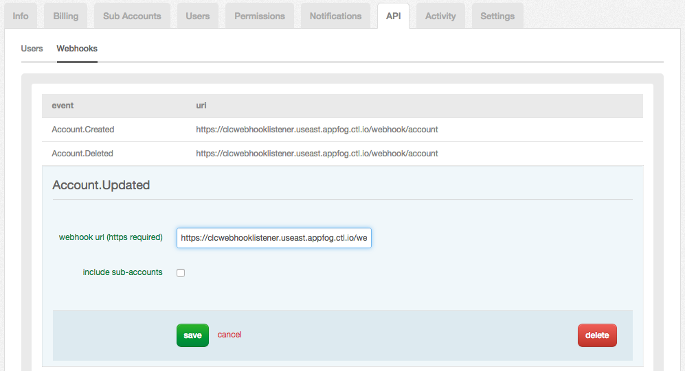

{{{
  "title": "Configuring Webhooks and Consuming Notifications",
  "date": "03-25-2015",
  "author": "",
  "attachments": [],
  "related_products": [],
  "related_questions": [],
  "preview" : "Subscribe to key events that occur in your CenturyLink Cloud account.",
  "thumbnail": "../images/webhooks-walkthrough-preview.png",
  "contentIsHTML": false
}}}

<iframe width="560" height="315" src="https://www.youtube.com/embed/bJdAnDo4XBg" frameborder="0" allowfullscreen></iframe>

### Introduction

Webhooks make it possible to subscribe to key events that occur in the CenturyLink Public Cloud. Platform events (e.g. "server created", "account updated", etc.) are sent in real-time as a an JSON message to a web endpoint configured for the Webhook. There are a number of use cases where you might be able to use Webhooks to replace or augment the components of existing processes. This includes replacing polling-based synchronization solutions, performing real-time data analytics, or monitoring activities with security or compliance implications, to name just a few.

Below are the steps to create a Webhook listener, configure a Webhook, and receive a notification. For more details on Webhooks, see the [Webhooks FAQ](//www.ctl.io/api-docs/v2/#webhooks-webhooks-faq).

### 1. Build and Deploy a Webhook Listener

A Webhook listener is simply a web application that can receive a JSON message via `HTTP POST`. When designing and deploying a Webhook listener, consider the following:

 - Decide what events to subscribe to. Webhooks support _Account_, _Alert_, _User_, and _Server_ events.
 - Process HTTP POST requests and handle the payload for each message type. (Examples of the payload for each type can be found in the [Webhooks FAQ](//www.ctl.io/api-docs/v2/#webhooks-webhooks-faq).)
 - The Webhook listener must be deployed to an internet-facing location that is reachable by the CenturyLink platform and that has a valid (not self-signed) SSL certificate.

A working example application written in Node.js can be [downloaded from GitHub](https://github.com/Tier3/Examples/tree/master/CLC.WebHookListener) and seen in action at [https://clcwebhooklistener.useast.appfog.ctl.io/](https://clcwebhooklistener.useast.appfog.ctl.io/). This example application will be the Webhook listener used for the rest of this demonstration.

### 2. Configure a Webhook in the CenturyLink Cloud Control Portal

From the Control Portal, use the menu to navigate to the **API** settings and click on the **Webhooks** sub-tab to review the list of available Webhooks. Here, you can configure unique endpoints for each individual Webhook. In the image below, notice that the **Account.Updated** Webhook is set with the URL to the example listener web application. To respond to events that occur in sub-accounts as well, select the **include sub-accounts** checkbox.

Click **save** when the configuration is complete and add URLs for any other Webhooks of interest.

### 3. Test the Webhook

Trigger an event in the platform that the Webhook will respond to. (View the [Webhooks FAQ](//www.ctl.io/api-docs/v2/#webhooks-webhooks-faq) for a list of what platform events will trigger a Webhook notification.) To get the **Account.Updated** Webhook configured above to fire, change an account setting such as the mailing address.

Save the account change, and within seconds, the Webhook listener service should receive the notification message. In [the sample application](https://github.com/Tier3/Examples/tree/master/CLC.WebHookListener), this information is pushed to the browser. Clicking on the updated account's name reveals the full payload.

