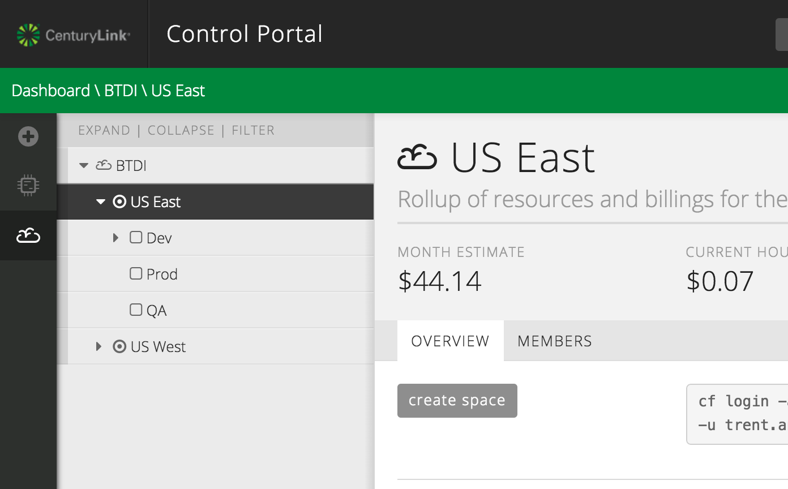
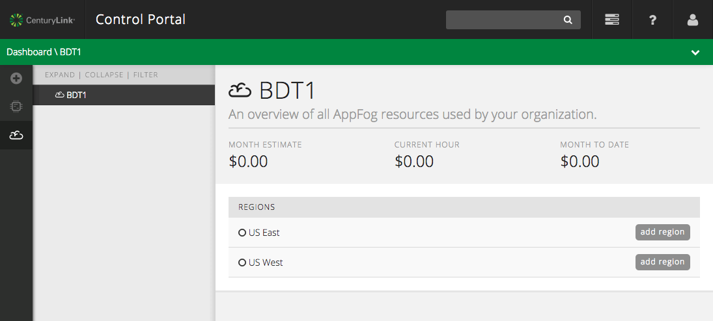
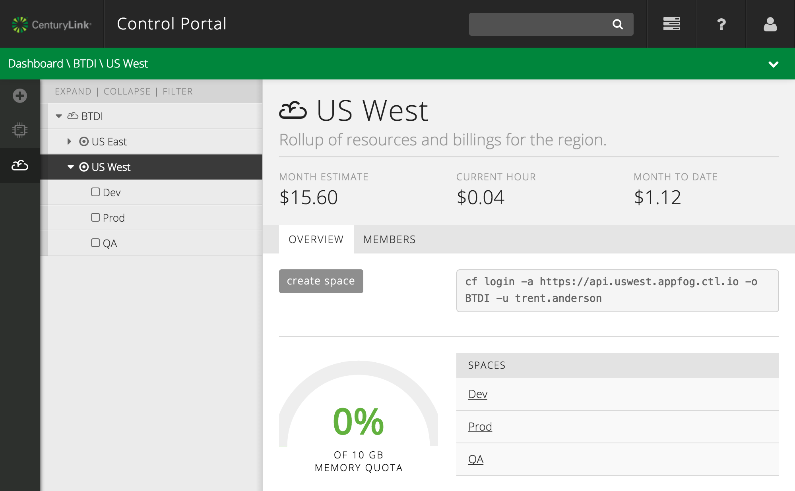
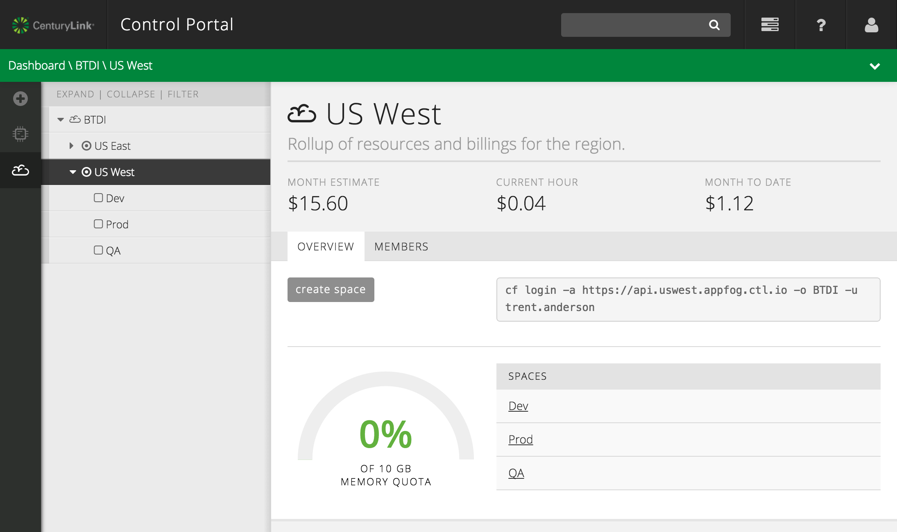
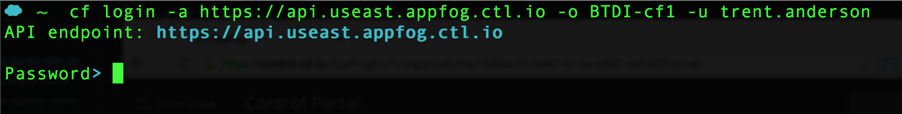
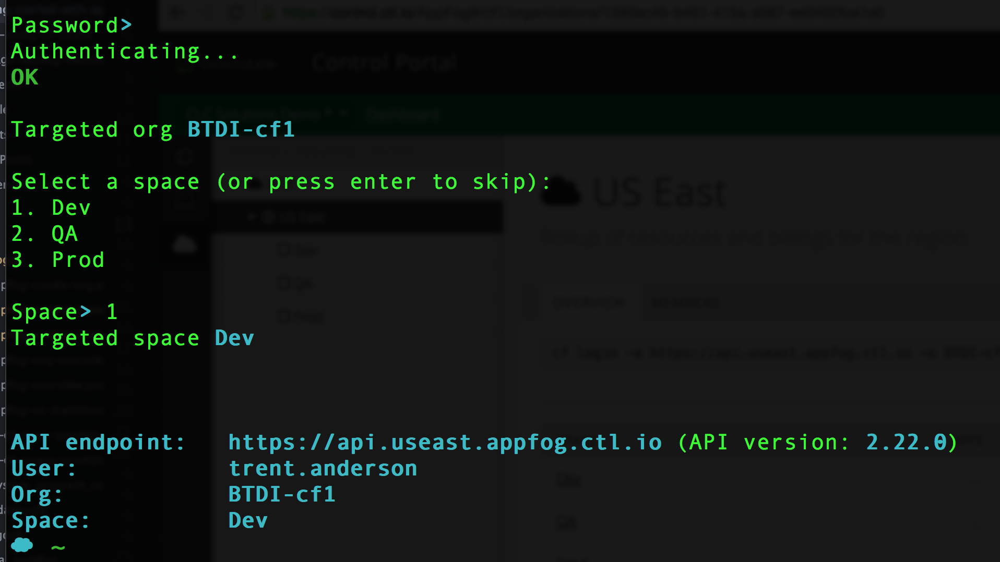
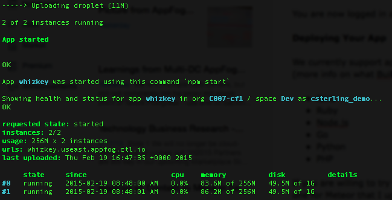

{{{
  "title": "Deploy an Application to AppFog",
  "date": "07-16-2015",
  "author": "Chris Sterling",
  "attachments": [],
  "related_products": [],
  "related_questions": [],
  "preview" : "Create an Org and deploy an application to AppFog using the Control Portal and Cloud Foundry CLI.",
  "thumbnail": "../images/appfog-deploy-preview.png",
  "contentIsHTML": false
}}}

<iframe width="560" height="315" src="https://www.youtube.com/embed/bsUAX1L3A1Y" frameborder="0" allowfullscreen></iframe>

### Introduction

AppFog is a public Platform-as-a-Service (PaaS) that makes deploying scalable, robust, high performing [cloud-ready applications](http://12factor.net) fast and easy for developers. AppFog enables developers to focus on writing great applications without having to worry about managing the underlying infrastructure. The result is increased agility and productivity, more efficient use of resources, and a simplified deployment and management experience.


AppFog supports the followng common application runtimes: Java, Node.js, PHP, Python, Go, Ruby, and Static Websites. Integrating with services such as databases, messaging middleware, load balancing, monitoring and more are easily provisioned through the AppFog Marketplace.

### Enable AppFog in Control Portal

Go to https://control.ctl.io, login, and navigate to AppFog via the icon on the left vertical navigation bar:



Now it is time to create an AppFog Organization for your Control Portal account. From the list of available regions, select the "add region" button and to activate it.



Once the region is activated, three spaces &mdash; Dev, QA, Prod &mdash; are created automatically.



### Install Cloud Foundry CLI

Download the appropriate [binary distribution of the Cloud Foundry CLI](https://github.com/cloudfoundry/cli/blob/master/README.md#downloads). Install the downloaded binary distribution of Cloud Foundry CLI. To verify Cloud Foundry CLI is installed run the following command from a terminal shell:

```
$ cf -v
cf version 6.10.0-b78bf10-2015-02-11T22:25:45+00:00
```

**NOTE:** The Ruby Gem based Cloud Foundry CLI is no longer supported and will not work with AppFog. Please make sure that you use the appropriate binary distribution from:

[https://github.com/cloudfoundry/cli/blob/master/README.md#downloads](https://github.com/cloudfoundry/cli/blob/master/README.md#downloads)

### Login to AppFog

Now that we have the Cloud Foundry CLI installed, lets login to AppFog. In the Control Portal, view the active AppFog region (you may need to refresh your browser) and Copy the full `cf login` shell command from the "Overview" tab.



The command should look similar to:

```
cf login -a https://api.useast.appfog.ctl.io -o C007 -u trent.anderson
```

Now paste the `cf login` command into a terminal shell and run it. You should be prompted for your CenturyLink Cloud Control Portal password.



Please type in your password and hit enter. After successfully authenticating with your credentials, you should be prompted for which AppFog Space to target for application deployments:



Choose Space number 1 "Dev" as shown in the image above. You are now logged in and ready to learn more about AppFog capabilities.

### Deploy an Application

We currently support applications using the following application runtimes in AppFog by default:

* Java
* [Node.js](//www.ctl.io/knowledge-base/appfog/deploy-nodejs-application)
* Ruby
* PHP
* Python
* Go
* Static websites

### Deploy Application

Once you have an application to deploy that is based on one of the supported application runtimes, you can deploy that application using the Cloud Foundry CLI. Here are the steps for deploying your application:

* Go to top-level directory for your application
* Run the command `cf push [name of app]` to deploy it into AppFog (NOTE: [name of app] must be unique so be clever with name such as “theultimateapp-100”)
* After the process has finished you should see something similar to the following:



* Copy the URL from “urls” line and open that URL in a browser

You should now see your application running!
