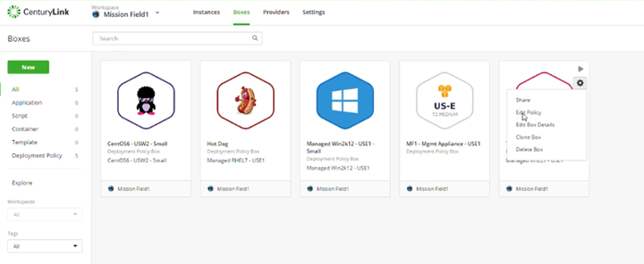
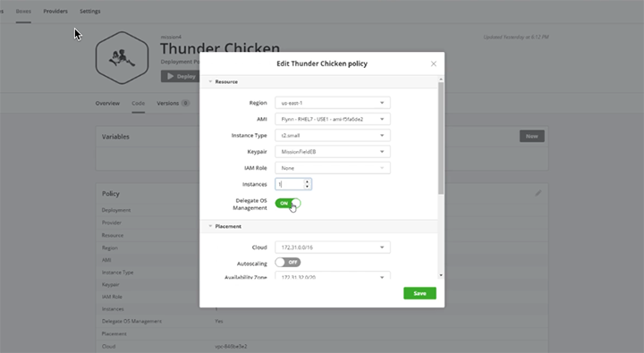
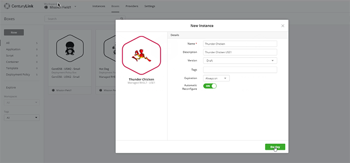
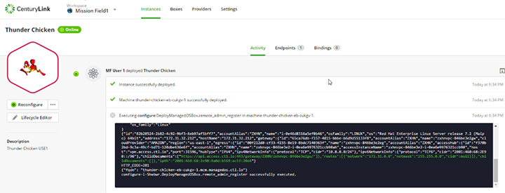

{{{
  "title": "Deploying a New Managed Instance in AWS",
  "date": "02-20-2017",
  "author": "Thomas Broadwell",
  "attachments": [],
  "related_products": [],
  "related_questions": [],
  "preview" : "How to Deploy a New Managed Instance in AWS Using Cloud Application Manager",
  "thumbnail": "../images/cloud-application-manager-deploy3.png",
  "contentIsHTML": false
}}}

<iframe width="560" height="315" src="https://player.vimeo.com/video/204249861" frameborder="0" allowfullscreen></iframe>

### Introduction

This tutorial will show you how to deploy a new managed instance within an existing AWS VPC account using [Cloud Application Manager](https://www.ctl.io/cloud-application-manager).

### Modify the Deployment Policy

Once you have [deployed a management appliance](./making-instance-managed-cloud-application-manager.md) within your AWS VPC, you're ready to start deploying managed instances within that VPC. First, you'll need to modify the deployment policy you'd like to use.

Within the **Edit** mode for the deployment policy, set the **Delegate OS Management** toggle to **ON**.

The **Delegate Managed OS** terms window will appear. Accept the terms and select **Enable**. Select **Save** on the edited deployment policy.

### Ready to Deploy

Now you can deploy a new managed instance using the deployment policy that you just edited.

The **Make Managed** process will run on the instance.

When complete, the **Activity** screen will be updated stating **Instance Successfully Deployed**.

