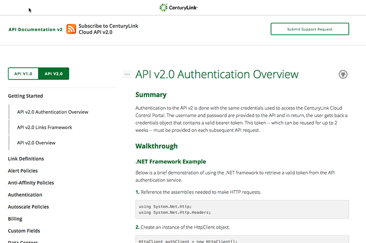
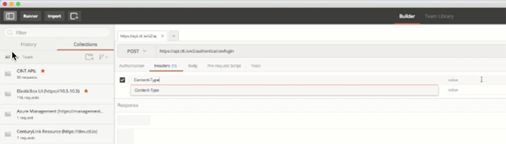
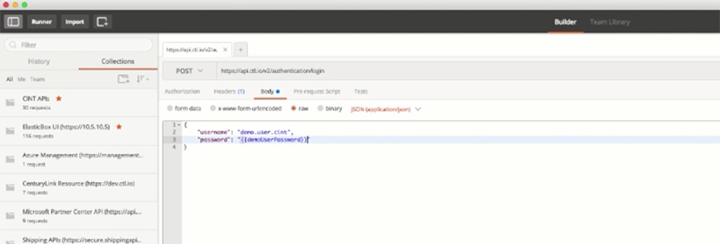
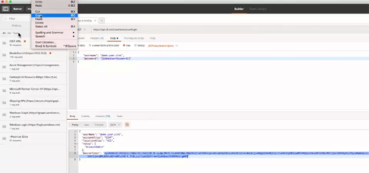
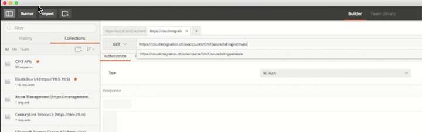
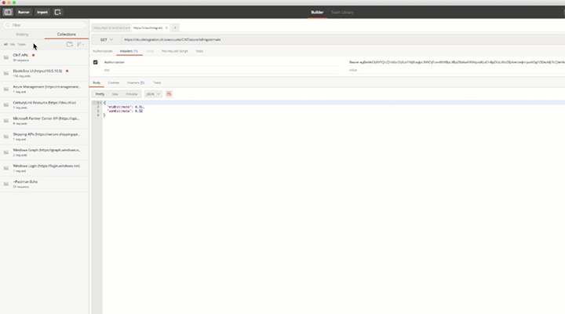

{{{
  "title": "Requesting Estimates for CSP Azure",
  "date": "02-20-2017",
  "author": "Ben Swoboda",
  "attachments": [],
  "related_products": [],
  "related_questions": [],
  "preview" : "Requesting Estimates for Azure CSP Customer Usage through Cloud Application Manager",
  "thumbnail": "../images/cloud-application-manager-estimates6.png",
  "contentIsHTML": false
}}}

<iframe width="560" height="315" src="https://player.vimeo.com/video/204245303" frameborder="0" allowfullscreen></iframe>

### Introduction

This tutorial will show you how to access your account's estimated Azure cloud usage through [Cloud Application Manager](https://www.ctl.io/cloud-application-manager) for month-to-date and end-of-month via API.

### Accessing the API

To access this functionality you'll need a bearer token for the CenturyLink Cloud account that is associated with the Azure Customer account. This is because we use the CenturyLink Cloud account to tie the Azure Customer account into our billing API. You can find more details about the CenturyLink Cloud [APIv2 on our website](https://www.ctl.io/api-docs/v2/#billing).

For the POST, type your username and password for the associated CLC account.

Follow the CenturyLink Cloud APIv2 Authentication instructions.

### The POST

In the **Builders** tab, navigate to **POST**.

The POST call will be to http://api.ctl.io/v2/authentication/login.

Enter a header of Content-Type: application/json, then enter your username and password for the associated CenturyLink Cloud account into the body.

Copy the resulting bearer token.

### The GET

In the **Builder** tab, navigate to **GET**.

The GET call will be to https://cloudintegration.ctl.io/accounts?YOURBILLINGALIAS/azure/billingestimate.

Enter a header of Authorization: Bearer, and then paste in the bearer token that you copied.

Click **Send**.

### The Estimates

It should return with the amount of usage dollars our system estimates you will be billed for if the month stopped today. In this example there are a few days left, so the end of month estimate has a little more usage. Please note these are estimates only.

