{{{
  "title": "Connecting Your AWS Account in Cloud Application Manager",
  "date": "12-12-2016",
  "author": "",
  "attachments": [],
  "related_products": [],
  "related_questions": [],
  "preview" : "Connecting Your AWS Account in Cloud Application Manager",
  "thumbnail": "../images/cloud-application-manager-provider4.png",
  "contentIsHTML": false
}}}

<iframe width="560" height="315" src="https://player.vimeo.com/video/126177639" frameborder="0" allowfullscreen></iframe>

### Introduction

You need to connect your cloud account before you can deploy workloads from Cloud Application Manager. Here's a quick step-by-step demo of how to connect to an AWS account.

### Create Custom AWS Policy

First, you need to create a custom AWS policy. From within your AWS account, click on the **Services** tab at the top of the page. From the drop down, select **IAM** &mdash; Amazon’s Identity and Access Management service.

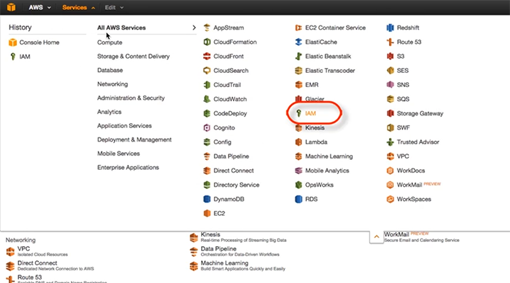

From the IAM **Dashboard** menu, select **Policies**.

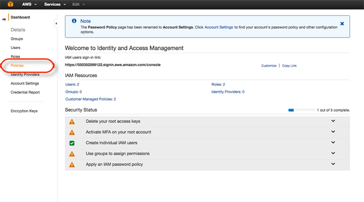

Select **Create Policy**. Next to **Create Your Own Policy**, click **Select**.

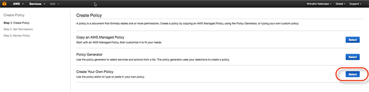

Give your policy a name, drop in a policy document with this permissions:
```
{
"Version": "2012-10-17",
"Statement": [
{
    "Action": [
        "autoscaling:CreateAutoScalingGroup",
        "autoscaling:CreateLaunchConfiguration",
        "autoscaling:DeleteAutoScalingGroup",
        "autoscaling:DeleteLaunchConfiguration",
        "autoscaling:DescribeScalingActivities",
        "autoscaling:DescribeAutoScalingGroups",
        "autoscaling:DescribeAutoScalingInstances",
        "autoscaling:DescribeLaunchConfigurations",
        "autoscaling:ResumeProcesses",
        "autoscaling:SuspendProcesses",
        "autoscaling:TerminateInstanceInAutoScalingGroup",
        "autoscaling:UpdateAutoScalingGroup",
        "cloudformation:CreateStack",
        "cloudformation:DeleteStack",
        "cloudformation:DescribeStackEvents",
        "cloudformation:DescribeStackResource",
        "cloudformation:DescribeStackResources",
        "cloudformation:DescribeStacks",
        "cloudformation:GetTemplate",
        "cloudformation:ListStacks",
        "cloudformation:ListStackResources",
        "cloudformation:UpdateStack",
        "cloudformation:ValidateTemplate",
        "cloudwatch:DescribeAlarms",
        "dynamodb:CreateTable",
        "dynamodb:DeleteTable",
        "dynamodb:DescribeTable",
        "dynamodb:ListTables",
        "ec2:AssociateAddress",
        "ec2:AttachVolume",
        "ec2:AllocateAddress",
        "ec2:AuthorizeSecurityGroupEgress",
        "ec2:AuthorizeSecurityGroupIngress",
        "ec2:CopyImage",
        "ec2:CreateImage",
        "ec2:CreateSecurityGroup",
        "ec2:CreateSnapshot",
        "ec2:CreateSubnet",
        "ec2:CreateTags",
        "ec2:CreateVolume",
        "ec2:DeleteSecurityGroup",
        "ec2:DeleteSubnet",
        "ec2:DeleteTags",
        "ec2:DeleteVolume",
        "ec2:DescribeAccountAttributes",
        "ec2:DescribeAddresses",
        "ec2:DescribeAvailabilityZones",
        "ec2:DescribeImageAttribute",
        "ec2:DescribeImages",
        "ec2:DescribeInstanceAttribute",
        "ec2:DescribeInstanceStatus",
        "ec2:DescribeInstances",
        "ec2:DescribeKeyPairs",
        "ec2:DescribePlacementGroups",
        "ec2:DescribeRegions",
        "ec2:DescribeSecurityGroups",
        "ec2:DescribeSubnets",
        "ec2:DescribeTags",
        "ec2:DescribeVolumeAttribute",
        "ec2:DescribeVolumeStatus",
        "ec2:DescribeVolumes",
        "ec2:DescribeVpcAttribute",
        "ec2:DescribeVpcs",
        "ec2:DescribeVpnConnections",
        "ec2:DetachVolume",
        "ec2:RebootInstances",
        "ec2:RegisterImage",
        "ec2:ReleaseAddress",
        "ec2:RevokeSecurityGroupEgress",
        "ec2:RevokeSecurityGroupIngress",
        "ec2:RunInstances",
        "ec2:StartInstances",
        "ec2:StopInstances",
        "ec2:TerminateInstances",
        "ecs:ListClusters",
        "elasticache:*",
        "elasticloadbalancing:CreateLoadBalancer",
        "elasticloadbalancing:CreateLoadBalancerPolicy",
        "elasticloadbalancing:DeleteLoadBalancer",
        "elasticloadbalancing:DeleteLoadBalancerPolicy",
        "elasticloadbalancing:DeregisterInstancesFromLoadBalancer",
        "elasticloadbalancing:DescribeInstanceHealth",
        "elasticloadbalancing:DescribeLoadBalancerPolicies",
        "elasticloadbalancing:DescribeLoadBalancers",
        "elasticloadbalancing:RegisterInstancesWithLoadBalancer",
        "elasticloadbalancing:SetLoadBalancerPoliciesOfListener",
        "elasticloadbalancing:ModifyLoadBalancerAttributes",
        "elasticloadbalancing:ConfigureHealthCheck",
        "iam:CreateUser",
        "iam:DeleteUser",
        "iam:ListAccessKeys",
        "iam:ListUserPolicies",
        "iam:ListServerCertificates",
        "iam:PutUserPolicy",
        "iam:GetUser",
        "iam:CreateAccessKey",
        "iam:DeleteUserPolicy",
        "iam:DeleteAccessKey",
        "iam:PassRole",
        "iam:ListRoles",
        "iam:ListInstanceProfilesForRole",
        "rds:AuthorizeDBSecurityGroupIngress",
        "rds:AddTagsToResource",
        "rds:CreateDBInstance",
        "rds:CreateDBSecurityGroup",
        "rds:CreateDBSnapshot",
        "rds:DeleteDBInstance",
        "rds:DeleteDBSecurityGroup",
        "rds:DeleteDBSnapshot",
        "rds:DescribeDBInstances",
        "rds:DescribeDBParameterGroups",
        "rds:DescribeDBParameters",
        "rds:DescribeDBSecurityGroups",
        "rds:DescribeDBSnapshots",
        "rds:DescribeDBEngineVersions",
        "rds:DescribeDBSubnetGroups",
        "rds:DescribeOptionGroups",
        "rds:ModifyDBInstance",
        "rds:ModifyDBSubnetGroup",
        "rds:RebootDBInstance",
        "rds:RemoveTagsFromResource",
        "rds:RestoreDBInstanceFromDBSnapshot",
        "rds:RevokeDBSecurityGroupIngress",
        "s3:CreateBucket",
        "s3:DeleteBucket",
        "s3:DeleteBucketPolicy",
        "s3:GetBucketAcl",
        "s3:GetBucketCORS",
        "s3:GetBucketLocation",
        "s3:ListAllMyBuckets",
        "s3:ListBucket",
        "s3:PutBucketAcl",
        "s3:PutBucketCORS",
        "s3:PutBucketPolicy",
        "s3:PutBucketTagging",
        "sts:AssumeRole",
        "support:*"
    ],
    "Sid": "Stmt1378777340000",
    "Resource": [
        "*"
    ],
    "Effect": "Allow"
}
]
}
```
 and click **Validate Policy**. When the policy has been validated successfully, click **Create Policy**.


Your Cloud Application Manager Policy has now been successfully created.

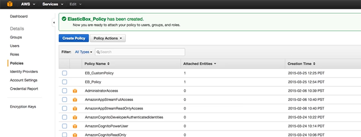

### Create IAM Role and Attach Policy

From your **Services** Dashboard in AWS, select **Roles**.

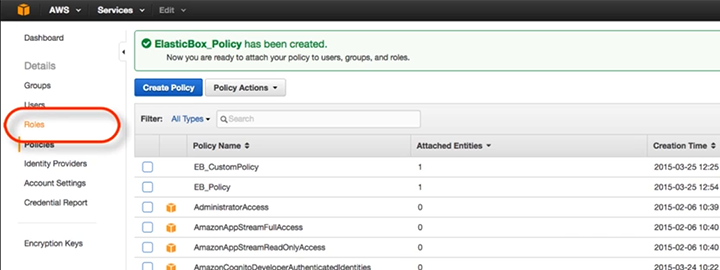

  * Click **Create a New Role**.
  * Set **Role Name**.
  * For **Role Type**, click on **Role for Cross-Account Access**.
  * Select the option **"Allows IAM users from a 3rd party AWS account to access this account.”**

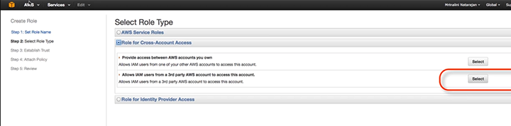

In **Establish Trust**, enter these values:
  * Account ID: **540339316802**
  * External ID: **elasticbox**
  * Require MFA: **Leave unselected**

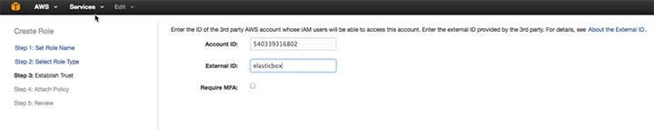

Now attach the new policy you just created to this role.

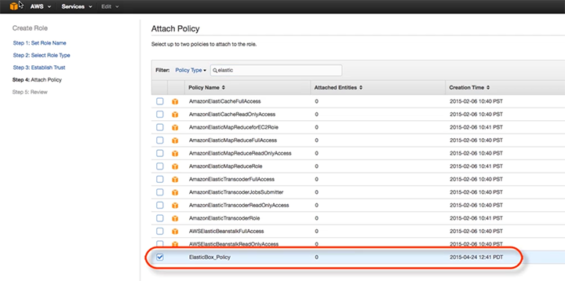

Review your newly defined role. If you're satisfied, click **Create Role** in the lower right hand corner.

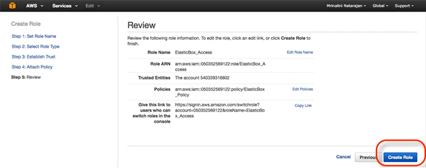

From the list of **Roles**, select the role you just created.

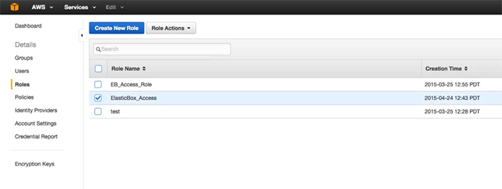

On the **Role Summary** page, you can now see the **Role ARN** (Amazon Resource Name.) Make a note of this name, because you'll need it for the last part of this exercise.

### Register IAM Role in Cloud Application Manager

From your workspace in Cloud Application Manager, select the **Providers** tab. Then click **New Provider**.

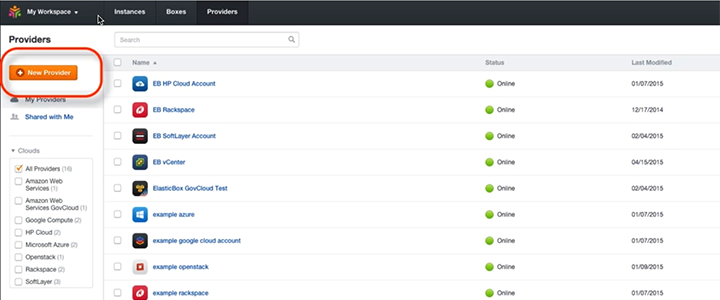

Select AWS from the cloud providers listed.

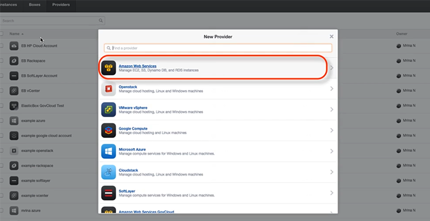

Give this **New Provider** a name. Then input your **Account Role ARN** that you just identified in AWS.

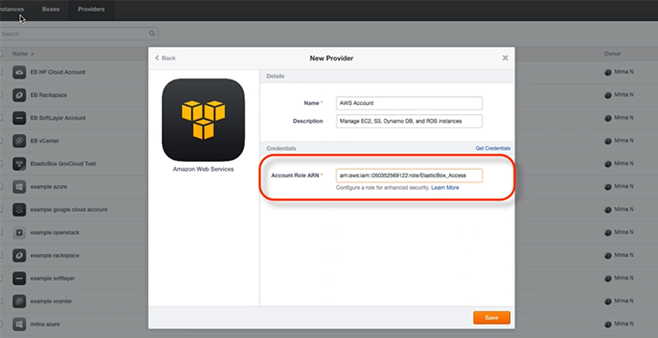

### This is What Success Looks Like

You’re done! Click on the **Logs** or **Configuration** tabs to view your settings.

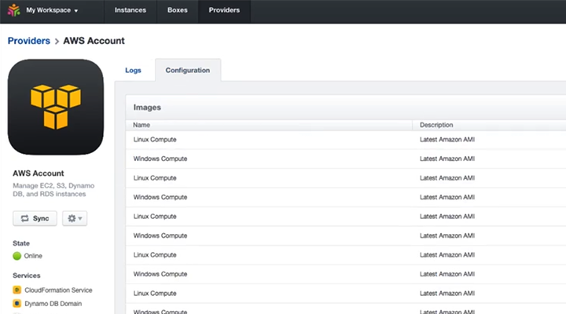
