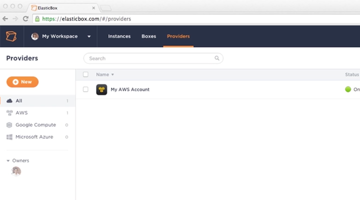
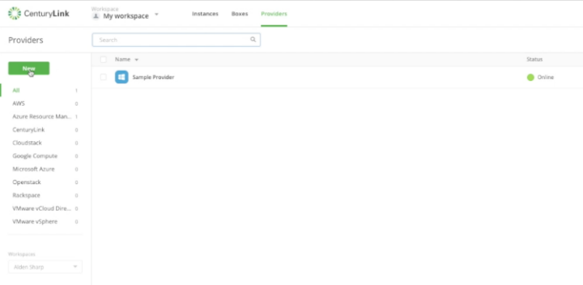
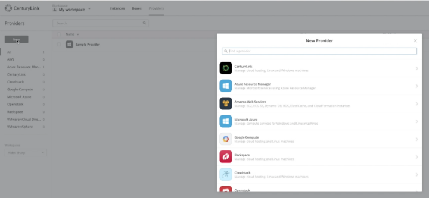
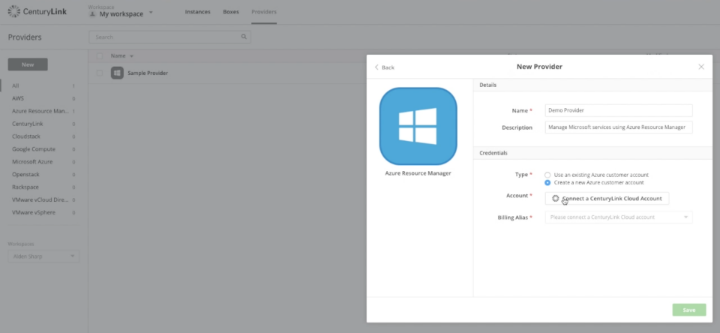
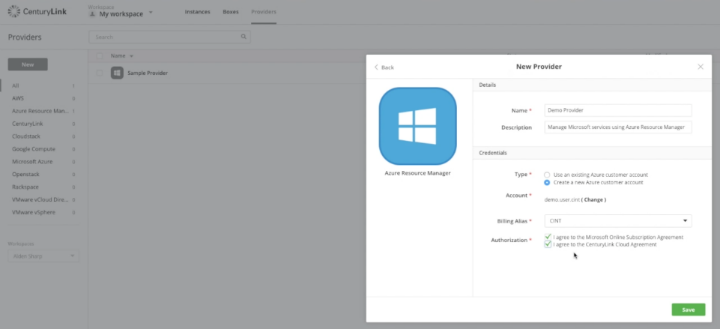

{{{
  "title": "Creating a New CSP Azure Provider",
  "date": "02-20-2017",
  "author": "",
  "attachments": [],
  "related_products": [],
  "related_questions": [],
  "preview" : "How to create a new provider in Cloud Application Manager",
  "thumbnail": "../images/cloud-application-manager-create-new-provider-thumbnail.png",
  "contentIsHTML": false
}}}

<iframe width="560" height="315" src="https://player.vimeo.com/video/204213296" frameborder="0" allowfullscreen></iframe>

This video shows how to create a new provider account in the Cloud Application Manager portal.

### Introduction

[Cloud Application Manager](https://www.ctl.io/cloud-application-manager) is a scalable platform for deploying enterprise mission-critical applications across any cloud infrastructure &ndash; private, public or hosted. It provides interactive visualization to automate application provisioning, including configuration, deployment, scaling, updating and migration of applications in real-time. Cloud Application Manager manages both traditional and cloud-native applications provisioned on bare metal and virtual machines across any type of infrastructure.

### Log Into Cloud Application Manager

To get started with Cloud Application Manager, sign up for an account and register your cloud service (CenturyLink, AWS or Azure, for example) as a provider.

### New Provider

After you log-in into Cloud Application Manager, click the **Provider** tab on the top toolbar.

Then click **New** on the left navigation bar.

### Connect a CenturyLink Cloud Account

Here you can see a list of available providers. In this example, we're going to select **Azure Resource Manager**.

Add a name for the account and then click **Connect a CenturyLink Cloud Account**.

Enter your CenturyLink Cloud administrator credentials. This ties Azure directly into the CenturyLink Cloud billing service. For billing purposes, note that the credentials you use must come from a CenturyLink Cloud account administrator.

Note the **Billing Alias** dropdown. We're going to leave it as the CINT alias, but you may select any account for which the user is the admin.

### Create the Provider

Once you have accepted the terms and conditions, the provider will kick off a process that generates a new Microsoft customer account with a Microsoft Azure subscription.

You can watch the creation process in real-time in the logs.
