{{{
  "title": "Launch Slave Build Environments with Jenkins and Cloud Application Manager",
  "date": "12-12-2016",
  "author": "",
  "attachments": [],
  "related_products": [],
  "related_questions": [],
  "preview" : "Launch slave build environments in any cloud with Jenkins and Cloud Application Manager",
  "thumbnail": "../images/cloud-application-manager-jenkins1.png",
  "contentIsHTML": false
}}}

<iframe width="560" height="315" src="https://player.vimeo.com/video/113452091" frameborder="0" allowfullscreen></iframe>

### Introduction

Ease the pain of setting up build environments for every cloud and every project by automating builds using Jenkins slaves powered by Cloud Application Manager. This demo walks you through the process with a typical ticketing SaaS App based on JBoss.

### Define a JBoss Build Slave in Cloud Application Manager

Start with a JBoss Box in Cloud Application Manager that installs a ticketing app with runtime dependencies like Java, Maven and the JBoss app server, as well as installing a slave agent on the machine.

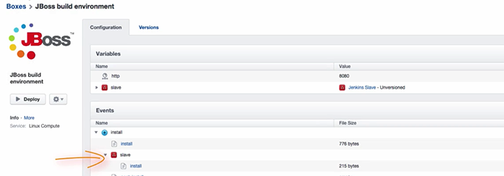

To deploy the JBoss environment on any cloud, you can attach the deployment profiles for a variety of cloud providers, including CenturyLink, AWS, Google Cloud, Azure, vSphere, OpenStack, etc. This lets you migrate your workload to any cloud without rebuilding your environment. For this exercise, select **Google Cloud**.

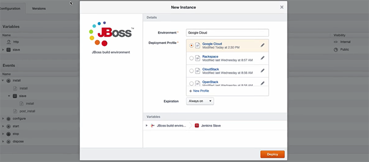

### Setup the Slave in Jenkins

Now go to Jenkins and log into Cloud Application Manager with an **Authentication Token**.

Select the JBoss slave box from the workspace. For **Deployment Profile**, select **Google Cloud**.

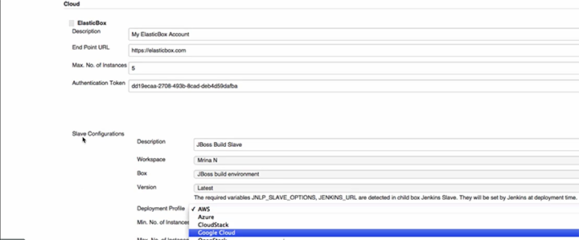

Now you need to tell JBoss how to use the slave. Select the maximum and minimum number of instances, and give the slave a **Label** to use in build jobs.

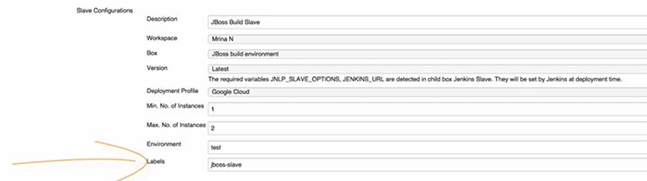

Then tell Jenkins how long to keep an idle slave alive, by setting a **Retention Time** of 30 days.

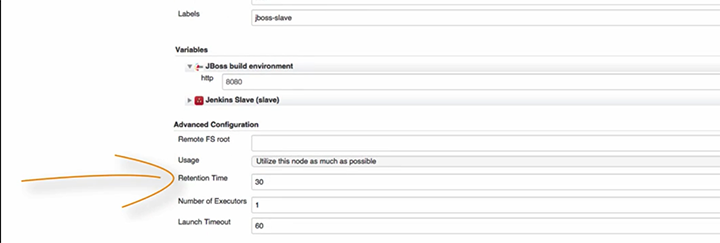

Finally, to create a test build job, select the slave by its Label.

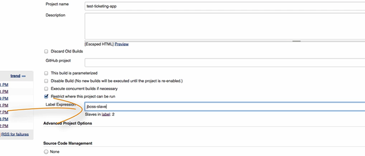

Since Jenkins is going to build and test the ticketing app by pulling the latest code from a repository, you'll also need to specify the repo URL.

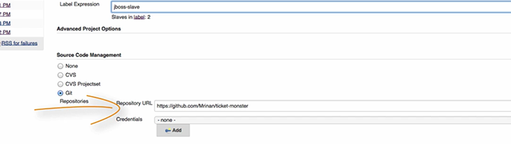

Next, add build commands. In our example, we're asking Maven to package and build a JBoss app and then run functional tests.

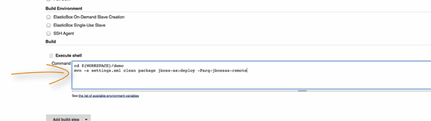

Save the job and watch it build.

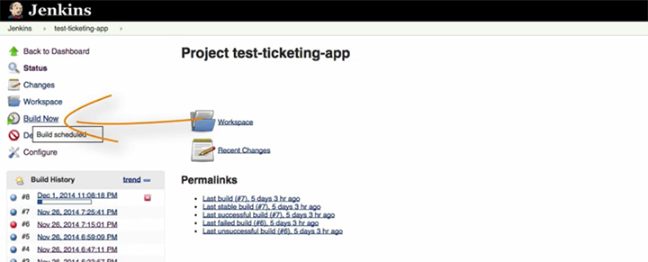

### Review the Build Logs from the Jenkins Console Output

Once we trigger the job, the build logs show the slave environments deployed through Cloud Application Manager.

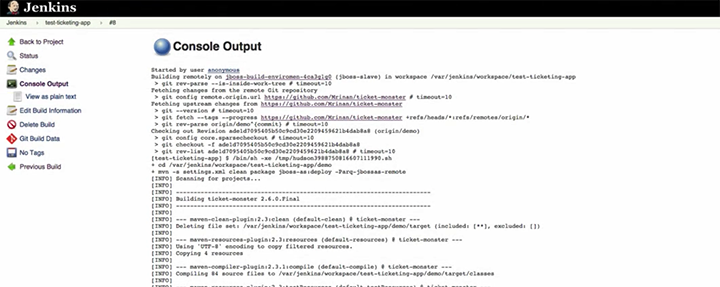

At this point, the JBoss build environment is ready.

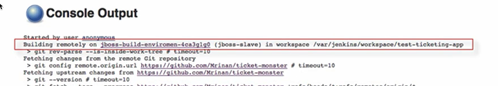

The logs also show that Maven installed the ticketing app and ran tests on the slave machine successfully.

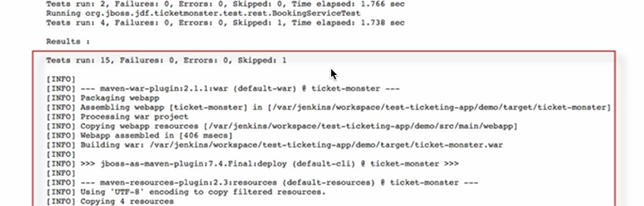

### Confirm the Build in Cloud Application Manager

Now from Cloud Application Manager, navigate to the Instance of the JBoss application and browse to its IP address.

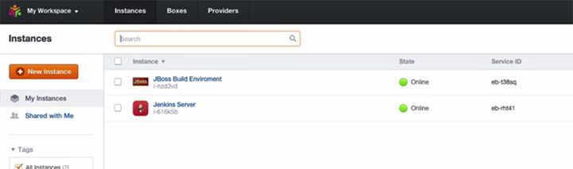

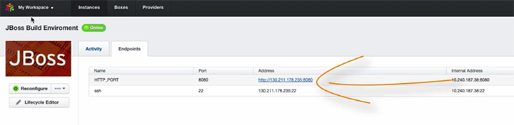

That’s all there is to it.
