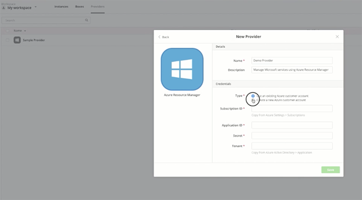
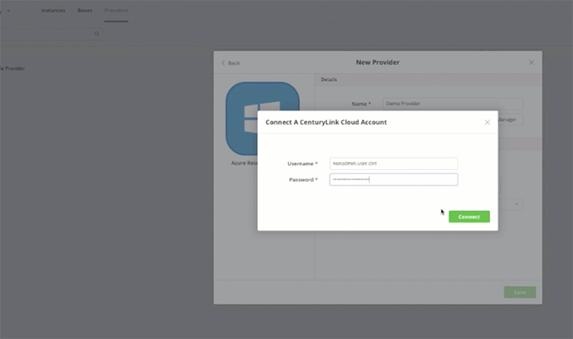

{{{
  "title": "Error when Alias is Not Billable",
  "date": "02-20-2017",
  "author": "Ben Swoboda",
  "attachments": [],
  "related_products": [],
  "related_questions": [],
  "preview" : "Error When CenturyLink Cloud Alias Selected in Cloud Application Manager Is Not Billable",
  "thumbnail": "../images/cloud-application-manager-billable1.png",
  "contentIsHTML": false
}}}

<iframe width="560" height="315" src="https://player.vimeo.com/video/204243772" frameborder="0" allowfullscreen></iframe>

### Introduction

CenturyLink Cloud does not currently sell Azure through Cloud Application Manager to resellers, internal accounts or demo accounts, or to sub-accounts of those categories.

### Non-Billable Aliases

The following error will appear if the CenturyLink Cloud alias you select is a reseller, internal, demo or sub-account, and is therefore designated "not billable."

Here's how you can arrive at this error message. After you log-in into Cloud Application Manager, click the **Provider** tab on the top toolbar.

Then click **New Provider** on the left navigation bar.

Select **Azure Resource Manager** to build a customer account in the current Microsoft Azure. Note: this is the new Azure, not the classic Azure. The dialog box that appears will enable you to create a new Azure customer account. Add a name for the account and select the **Create a new Azure customer account** option.

Click **Connect a CenturyLink Cloud Account** and enter your CLC account admin credentials. This ties Azure directly into the CenturyLink Cloud billing service.

### The Exception Message

If the CenturyLink Cloud billing account is the wrong account type, an error message will appear letting you know we are not permitted to offer the product to you. If you send us a support request we can review your case for you.

