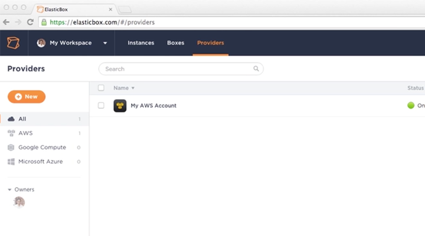
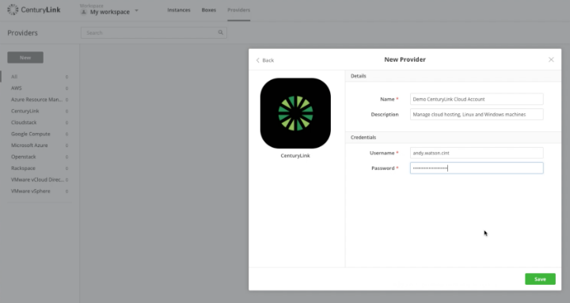
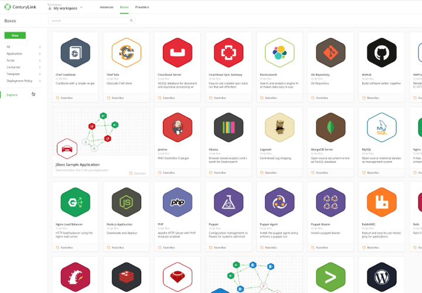
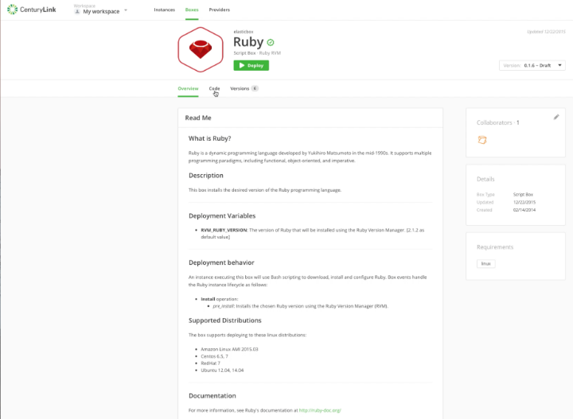
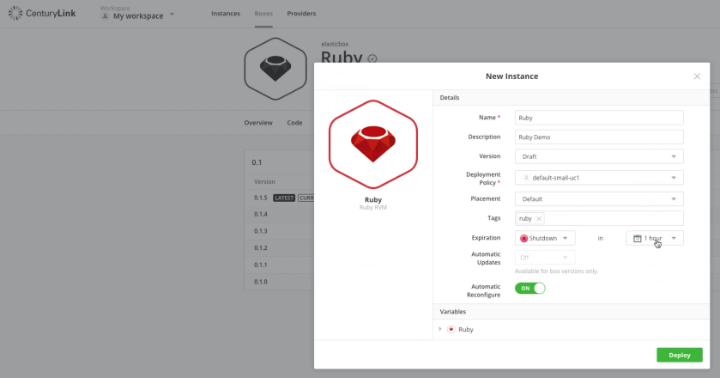
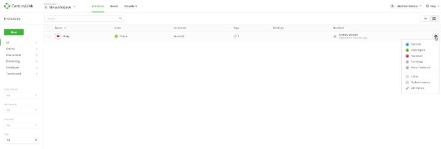

{{{
  "title": "Getting Started in the Workspace",
  "date": "02-20-2017",
  "author": "",
  "attachments": [],
  "related_products": [],
  "related_questions": [],
  "preview" : "An overview of Cloud Application Manager",
  "thumbnail": "../images/cloud-application-manager-getting-started-workspace-thumbnail.png",
  "contentIsHTML": false
}}}

<iframe width="560" height="315" src="https://player.vimeo.com/video/204245874" frameborder="0" allowfullscreen></iframe>

This video gives new users an overview of the Cloud Application Manager workspace. It focuses on setting up a provider and deploying a box using a default deployment policy.

### Introduction

[Cloud Application Manager](https://www.ctl.io/cloud-application-manager) is a scalable platform for deploying enterprise mission-critical applications across any cloud infrastructure &ndash; private, public or hosted. It provides interactive visualization to automate application provisioning, including configuration, deployment, scaling, updating and migration of applications in real-time. Cloud Application Manager manages both traditional and cloud-native applications provisioned on bare metal and virtual machines across any type of infrastructure.

### Log Into Cloud Application Manager

To get started with Cloud Application Manager, sign up for an account and register your cloud service (CenturyLink, AWS or Azure, for example) as a provider.

### New Provider

After you log-in into Cloud Application Manager, click the **Provider** tab on the top toolbar.

Then click **New** on the left navigation bar.

Here you can see a list of available providers. In this example, we're going to select **CenturyLink Cloud** as the provider.

Add a name for the account and then add your CenturyLink Cloud account credentials.

Clicking **Save** creates the provider and takes you to a separate page where you can view information about the provider, such as activity logs, configurations, and any unregistered instances of your account.

For information on how to create a new provider for Azure, see this [video](./creating-new-provider-with-cloud-application-manager.md).

### Deployment Policy Boxes

Once you've set up a provider, there are several default deployment policy boxes that are provided to you in Cloud Application Manager. You can see them by clicking the **Boxes** tab on the top toolbar.

Deployment policies are only one type of box that can be deployed in the Cloud Application Manager workspace. To access other types, again navigate to the **Boxes** tab on the top toolbar, then on the left toolbar click **Explore**.

This will show you all the different types of default boxes available to you from day one when you use Cloud Application Manager.

### Deploy a New Box

For this example we're going to deploy a default Ruby box. You can see on the page a description of the box, the version, the supported linux distributions, and the expected results of deploying the box.

You can also view each aspect of the code by clicking on the **Code** tab. Here you can see the code for **pre_install event**. You can also make modifications to the code on this screen.

On the versions tab, you can see all supported versions of the box and can change versions from the drop-down at the top of the page.

After you click **Deploy**, you'll be taken to a **New Instance** page where you can enter the specific details for your instance, such as giving it a description, selecting the version and deployment policy, applying tags, and scheduling an expiration time (if you only want the script to run for a specific amount of time before being deleted).

Once you're done, click **Deploy**. You'll be able to watch the deployment activity in the real-time logs.

### Edit Boxes

Once the Ruby box has been successfully deployed, you can see information about it, such as the endpoints and bindings.

If you navigate back to **Instances**, you can see the Ruby box instance is now **online**.

If you click the dropdown next to the instance, there are also options to easily shut down, reconfigure, or terminate the instance should you need to. You can also edit the instance while it is online.

