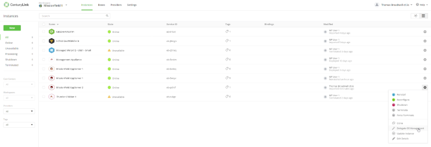
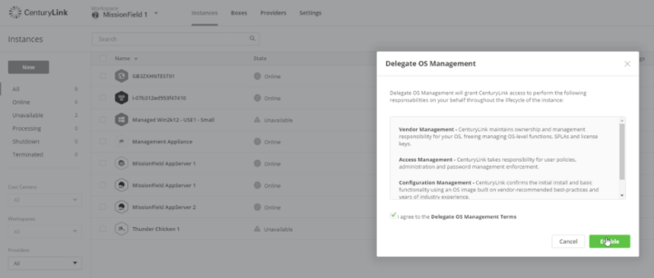
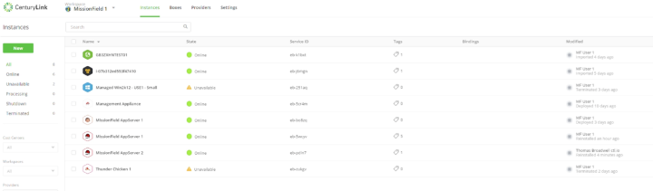

{{{
  "title": "Making an Instance Managed",
  "date": "02-20-2017",
  "author": "",
  "attachments": [],
  "related_products": [],
  "related_questions": [],
  "preview" : "Making a registered instance managed in Cloud Application Manager",
  "thumbnail": "../images/cloud-application-manager-make-instance-managed-thumbnail.png",
  "contentIsHTML": false
}}}

<iframe width="560" height="315" src="https://player.vimeo.com/video/204246280" frameborder="0" allowfullscreen></iframe>

This video shows users how to make a Cloud Application Manager registered VM instance managed (assigning the instance to be managed by Cloud Application Manager Managed Services).

### Introduction

[Cloud Application Manager](https://www.ctl.io/cloud-application-manager) is a scalable platform for deploying enterprise mission-critical applications across any cloud infrastructure &ndash; private, public or hosted. It provides interactive visualization to automate application provisioning, including configuration, deployment, scaling, updating and migration of applications in real-time. Cloud Application Manager manages both traditional and cloud-native applications provisioned on bare metal and virtual machines across any type of infrastructure.

### Log Into Cloud Application Manager

To get started with Cloud Application Manager, sign up for an account and register your cloud service (CenturyLink, AWS or Azure, for example) as a provider.

### Instances

To make a Cloud Application Manager registered VM instance managed, click the **Instances** tab on the top toolbar.

From the list of available instances, select the drop-down next to the instance you want to make managed.

Select **Delegate OS Management** from the drop-down list.

### Delegate OS Management

The **Delegate OS Management** screen will display the terms of management. These are the responsibilities the Cloud Application Manager will take on as part of the managed service.

Agree to the Delegate OS Management terms by clicking the checkbox.

The click **Enable**.

### Cloud Application Manager Process

The Cloud Application Manager "make managed" process will begin. It may take a few minutes to complete.

While the process is running, the instance state will change to **Reinstalling** in real-time for the instance being made managed.

When complete, the instance state will change to **Online**. You instance is now managed with Cloud Application Manager Managed Services.

For more information on the capabilities of Managed Services, see this [video]().
