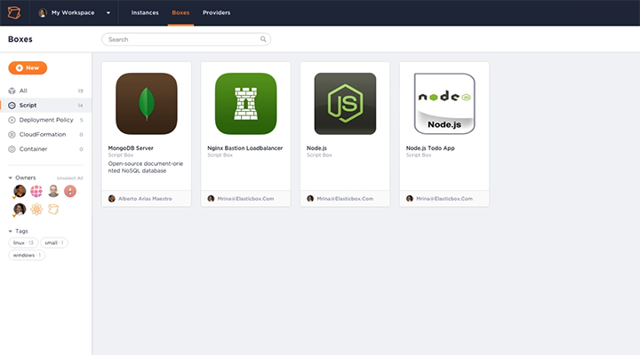
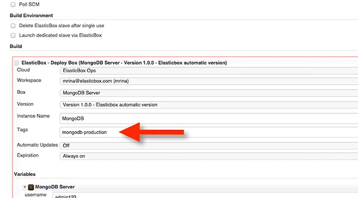
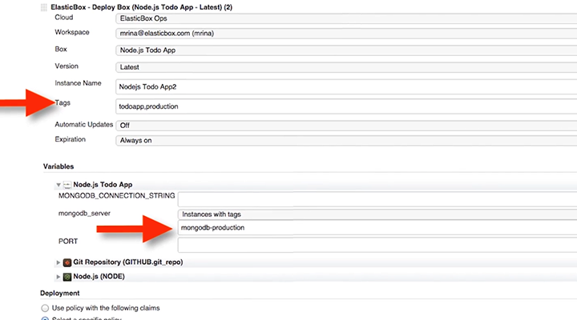
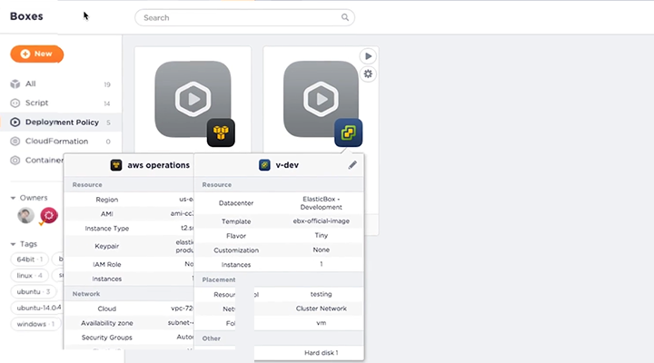
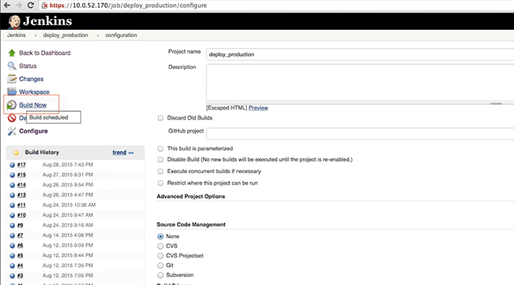

{{{
  "title": "Large Scale Continuous Deployments to Hybrid Clouds",
  "date": "12-12-2016",
  "author": "",
  "attachments": [],
  "related_products": [],
  "related_questions": [],
  "preview" : "Large Scale Continuous Deployments to Hybrid Clouds",
  "thumbnail": "../images/elasticbox-cd.png",
  "contentIsHTML": false
}}}

<iframe width="560" height="315" src="https://player.vimeo.com/video/137891194" frameborder="0" allowfullscreen></iframe>

### Introduction

ElasticBox integrates microservice automation, configuration management, and many tools for single click deployments. This demo shows continuous deployment of a multi-tier Node.js application to hybrid clouds.

### The Challenge of Continuous Deployment

Continuous deployments are challenging. Hybrid clouds, multiple tools, configuration management and updates across the stack all take time and attention. ElasticBox integrates microservice automation, configuration management and many tools for single click deployments.

### Define Reusable Microservices

In your ElasticBox account, define your Node.js app stack as reusable microservices. In this example, MongoDB is the database and Nginx Bastion is both the web server and load balancer.

### Use Bindings to Connect Layers

Bindings will connect the layers over the network. Node.js connects to MongoDB using a connection string from the binding at deployment time. Similarly, Nginx detects Node.js instances through the services binding and adds them to the load balancing pool.

### Set Up Continuous Deployment
Install Jenkins server with the ElasticBox plugin from the free public box catalog.

Then add your ElasticBox account with an authentication token. This helps pull all the box automation from your account. Now, set up the continuous deployment flow in a Jenkins production job.

The first build step deploys MongoDB. Tag it so that Node.js application instances can bind to it.

Next, deploy a couple of Node.js application instances, again tagging them to allow Nginx to bind to them. Note that Node.js instances can connect to MongoDB using a binding tag as well.

Finally, last build step launches the Nginx load balancer.
In all of this, the plugin automatically detects hybrid cloud environments and cloud infrastructure policies through ElasticBox. This is all made possible through ElasticBox’s Deployment Policies.

### Deployment Policies

In ElasticBox workspace, you can create deployment policies for both public and private clouds. The AWS policy lets you deploy to the AWS public cloud and the vSphere policy lets you to deploy to a private cloud.

If you look at this Jenkins job, you can see that Mongo DB uses a vSphere policy to deploy to a private data center, which many enterprises prefer. The Node.js application instances and Nginx webserver deploy to AWS.

### Ready to Build

Now you're ready for one-click deployment. In just a few minutes your entire Node.js multi-tier application stack will be deployed and working.

### Deployment Complete

See how binding tags automatically connect to the application layers.

Now you can browse to the Node.js application and go to work.

