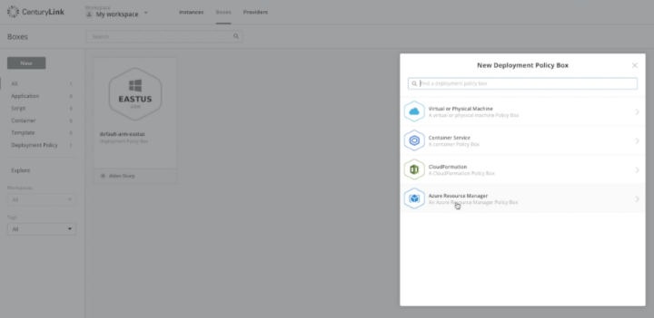
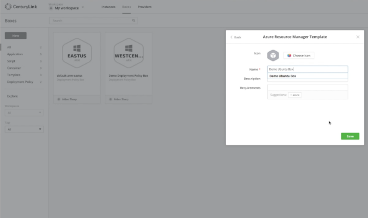
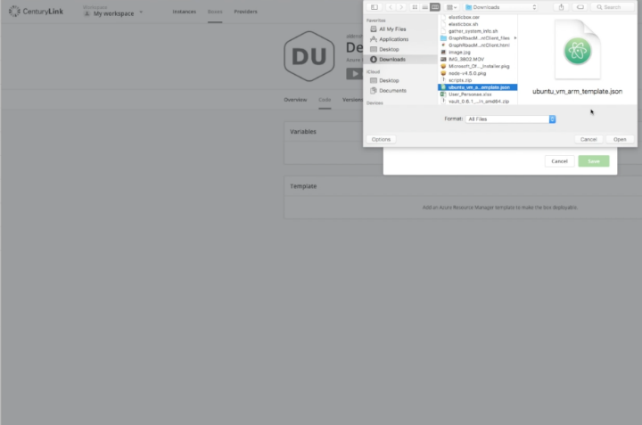
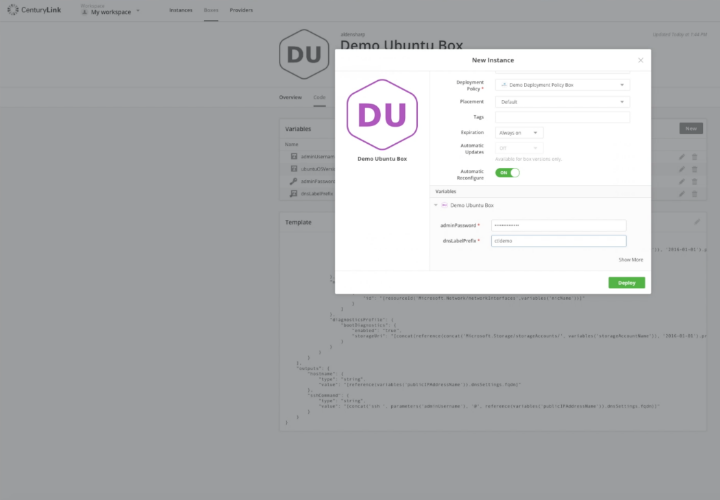
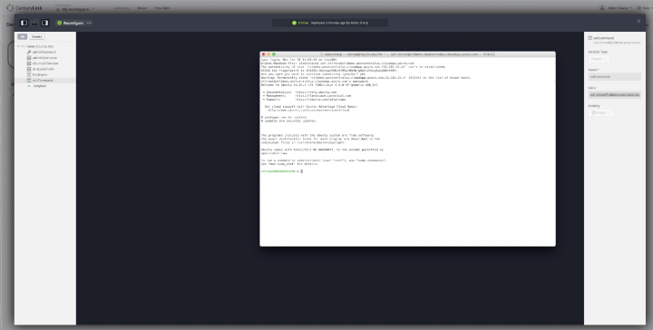

{{{
  "title": "Using ARM Templates for Microsoft Azure with Cloud Application Manager",
  "date": "02-20-2017",
  "author": "",
  "attachments": [],
  "related_products": [],
  "related_questions": [],
  "preview" : "Using ARM Templates in Cloud Application Manager",
  "thumbnail": "../images/cloud-application-manager-using-arm-templates-thumbnail.png",
  "contentIsHTML": false
}}}

<iframe width="560" height="315" src="https://player.vimeo.com/video/204244008" frameborder="0" allowfullscreen></iframe>

This video will show you how you can use an ARM template to manipulate resources within an existing Microsoft Azure Customer. This can be done for any Azure account. We will create a deployment policy box, apply it to a template box, add a pre-existing ARM template to an Ubuntu template box, deploy the instance, and then ssh into the instance.

### Introduction

Cloud Application Manager is a scalable platform for deploying enterprise mission-critical applications across any cloud infrastructure &ndash; private, public or hosted. It provides interactive visualization to automate application provisioning, including configuration, deployment, scaling, updating and migration of applications in real-time. Cloud Application Manager manages both traditional and cloud-native applications provisioned on bare metal and virtual machines across any type of infrastructure.

### Log Into Cloud Application Manager

To get started with Cloud Application Manager, sign up for an account and register your cloud service (CenturyLink, AWS or Azure, for example) as a provider.

### Create Deployment Policy Box

After you log-in into Cloud Application Manager, click the "Boxes" tab on the top toolbar.

Then click "New" and then "Deployment Policy" on the left navigation bar.

Select Azure Resource Manager to build a deployment policy box in the current Microsoft Azure.

Select the ARM provider for the existing Cloud Services Provider Azure customer.

Fill in the required deployment policy box name and any other details.

You can also add claims from the existing ones or create your own and select an instance lifespan; here we’re going to leave the instance lifespan as "always on". Once you're done, save the deployment policy box.

### Apply Template Box

Now that you have created the deployment policy box, you’ll be able to apply it to a template box where you will paste the ARM template.

Navigate back to the "Boxes" tab and click "New" and "Template".

Again, select select Azure Resource Manager, because that is the one necessary for ARM templates.

Fill in the required template box name and any other details or claims you desire.

### Add ARM Template

The most important aspect of the template box is the code. Click on the "Code" tab and click "New" next to "Template". Here you can either create a new blank template and then copy and paste in a JSON file, or you can upload an existing template if you already have one saved. We’ve already downloaded one from Azure’s github repo called "Azure quickstart templates".

Once you upload and save the code, the template box will recognize any key value pairs and give you the option of making edits.

### Deploy Instance

Once you save the code, you have the option of deploying instantly. Click "Deploy" and select the Deployment Policy box we created earlier. You will also need to fill in the required from the JSON file / ARM Template (in this case, the adminPassword and dnsLabelPrefix are required, but you can also fill in more variables by clicking "Show More").

Click "Deploy".

### SSH into Instance

Once the instance is deployed, select "Lifecycle Editor" on the left navigation bar in order to find a command that allows you to ssh to the instance.

In the Lifecycle Editor, select "sshCommand" from the list of commands.

Then copy the value and paste it into a terminal session.

Then enter the password when prompted to ssh into the instance.

