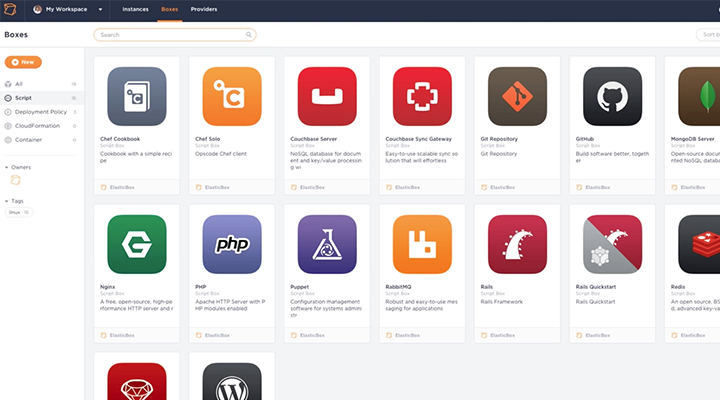
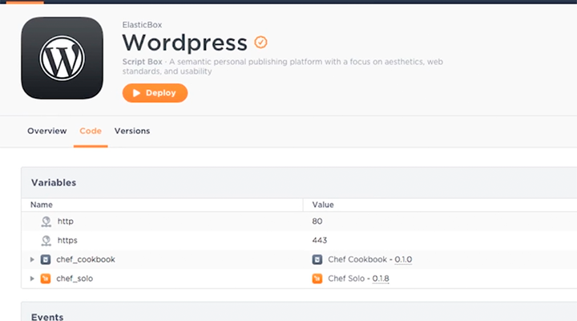
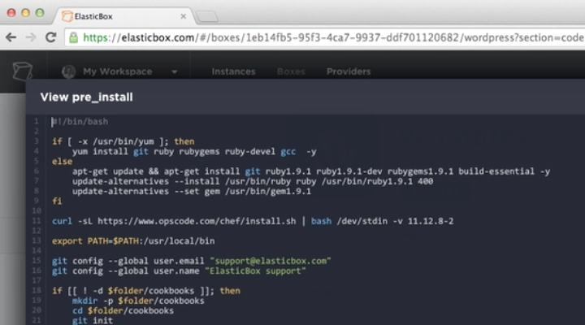
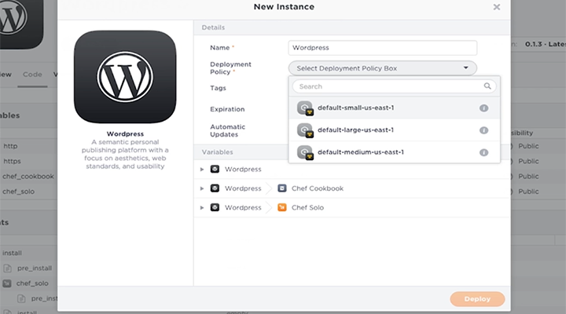
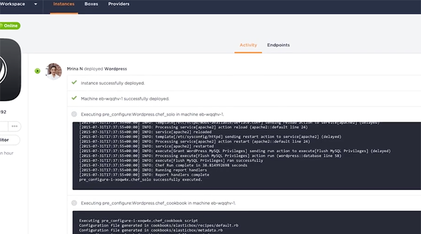
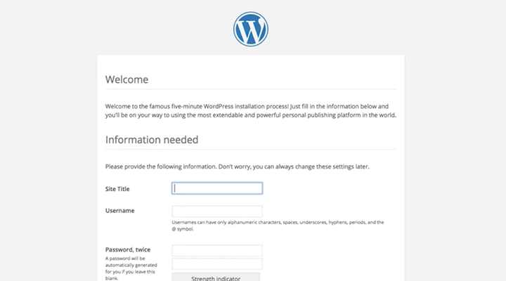

{{{
  "title": "Application Deployment with ElasticBox",
  "date": "12-12-2016",
  "attachments": [],
  "related_products": [],
  "related_questions": [],
  "preview" : "How to deploy any application using ElasticBox",
  "thumbnail": "../images/elasticbox-deploy-preview.png",
  "contentIsHTML": false
}}}

<iframe width="560" height="315" src="https://player.vimeo.com/video/135104898" frameborder="0" allowfullscreen></iframe>

This video shows how to quickly deploy a sample WordPress blog.

### Introduction

ElasticBox is a scalable platform for deploying enterprise mission-critical applications across any cloud infrastructure &ndash; private, public or hosted. It provides interactive visualization to automate application provisioning, including configuration, deployment, scaling, updating and migration of applications in real-time. ElasticBox manages both traditional and cloud-native applications provisioned on bare metal and virtual machines across any type of infrastructure.

### Log Into ElasticBox

To get started with ElasticBox, sign up for an account and register your cloud service (CenturyLink, AWS or Azure, for example) as a provider.

### The Box Catalog

The Box catalog has many sample applications you can readily deploy, including WordPress.

### Deploying WordPress

Here you can see that WordPress will install from a Chef recipe that uses Chef Solo to configure it.

Once you click Deploy, you can view the lifecycle of how the app installs and configures. It’s all detailed in the event scripts.

Select a cloud deployment policy. ElasticBox automatically creates this policy, which includes all the infrastructure meta data required to deploy successfully in your cloud.

On the WordPress instance page, you can track the instance of the deployment and see the entire step-by-step history of how WordPress is installed and configured.

### Start Using Your App

Once completed, the you'll be alerted that WordPress has successfully deployed and is online. You can now browse to its endpoint and start using WordPress right away.

