{{{
  "title": "Connecting Your AWS Account in ElasticBox",
  "date": "12-12-2016",
  "attachments": [],
  "related_products": [],
  "related_questions": [],
  "preview" : "Connecting Your AWS Account in ElasticBox",
  "thumbnail": "../images/elasticbox-provider4.png",
  "contentIsHTML": false
}}}

<iframe width="560" height="315" src="https://player.vimeo.com/video/126177639" frameborder="0" allowfullscreen></iframe>

### Introduction

You need to connect your cloud account before you can deploy workloads from ElasticBox. Here's a quick step-by-step demo of how to connect to an AWS account.

### Create Custom AWS Policy

First, you need to create a custom AWS policy. From within your AWS account, click on the **Services** tab at the top of the page. From the drop down, select **IAM** &msash; Amazon’s Identity and Access Management service.

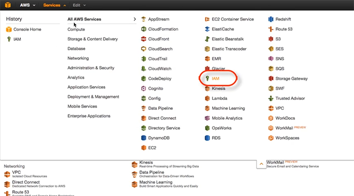

From the IAM **Dashboard** menu, select **Policies**.

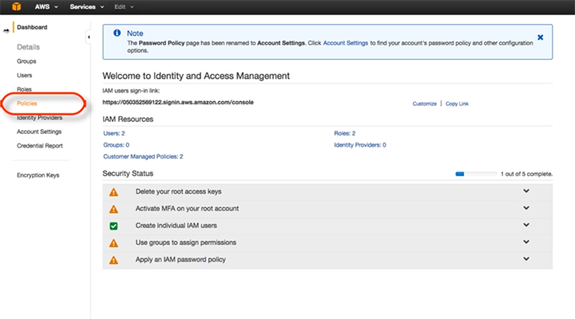

Select **Create Policy**. Next to **Create Your Own Policy**, click **Select**.

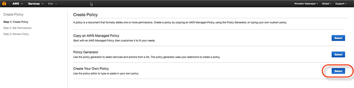

Give your policy a name, drop in your policy document and click **Validate Policy**. When the policy has been validated successfully, click **Create Policy**.

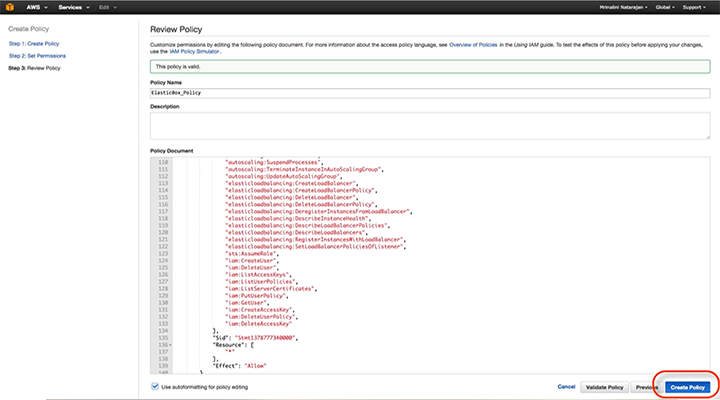

Your ElasticBox Policy has now been successfully created.

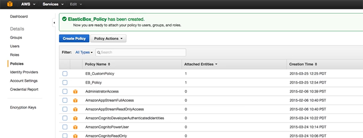

### Create IAM Role and Attach Policy

From your **Services** Dashboard in AWS, select **Roles**.

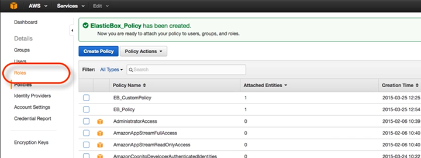

  * Click **Create a New Role**.
  * Set **Role Name**.
  * For **Role Type**, click on **Role for Cross-Account Access**.
  * Select the option **"Allows IAM users from a 3rd party AWS account to access this account.”**

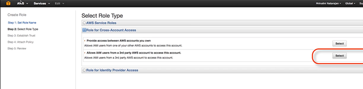

In **Establish Trust**, enter your **Account ID** and an **External ID**.

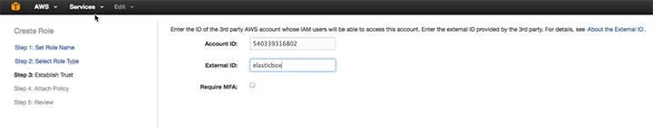

Now attach the new policy you just created to this role.

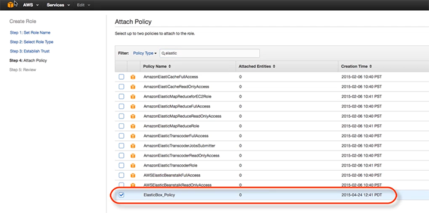

Review your newly defined role. If you're satisfied, click **Create Role** in the lower right hand corner.

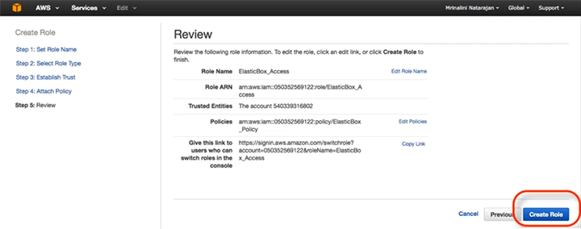

From the list of **Roles**, select the role you just created.

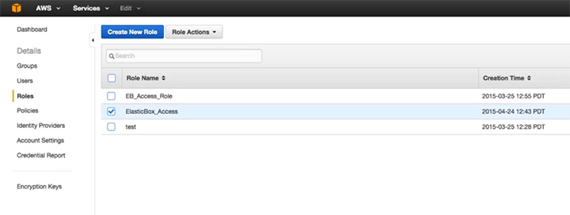

On the **Role Summary** page, you can now see the **Role ARN** (Amazon Resource Name.) Make a note of this name, because you'll need it for the last part of this exercise.

### Register IAM Role in ElasticBox

From your workspace in ElasticBox, select the **Providers** tab. Then click **New Provider**.

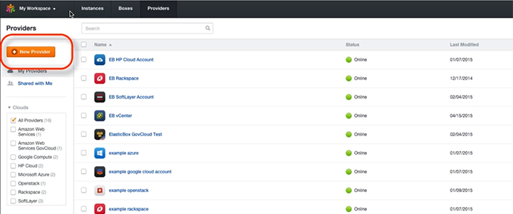

Select AWS from the cloud providers listed.

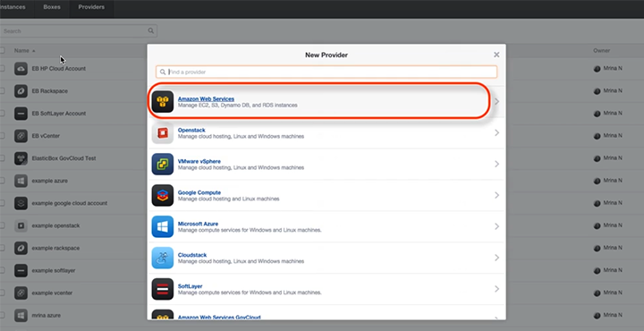

Give this **New Provider** a name. Then input your **Account Role ARN** that you just identified in AWS.

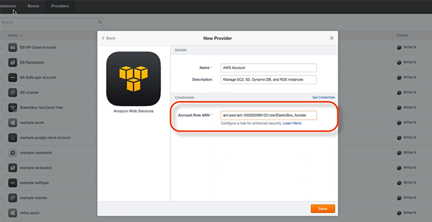

### This is What Success Looks Like

You’re done! Click on the **Logs** or **Configuration** tabs to view your settings.

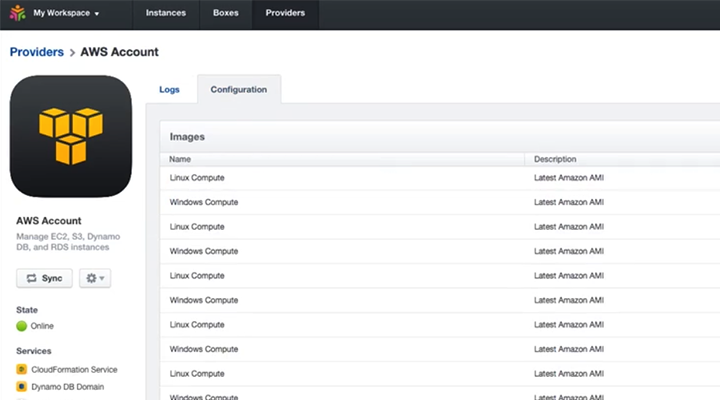
