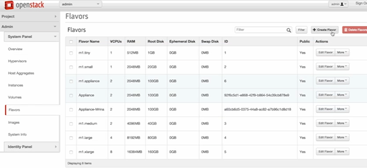
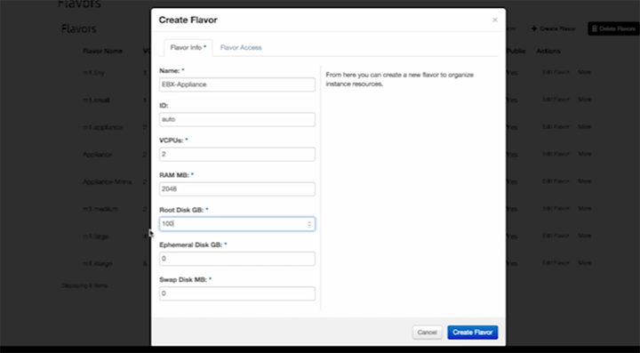
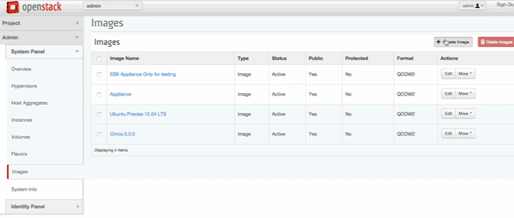
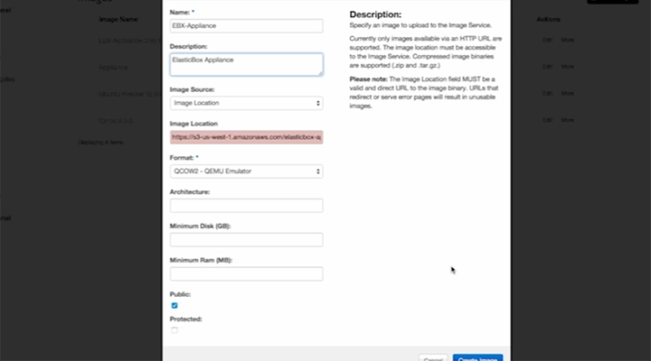
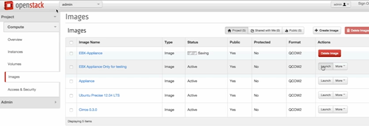
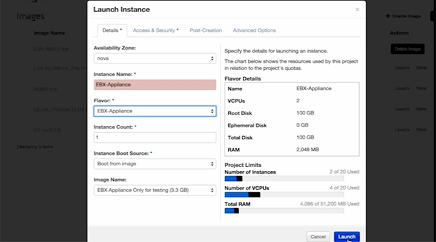
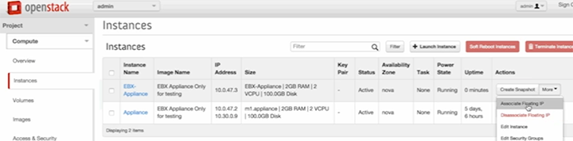
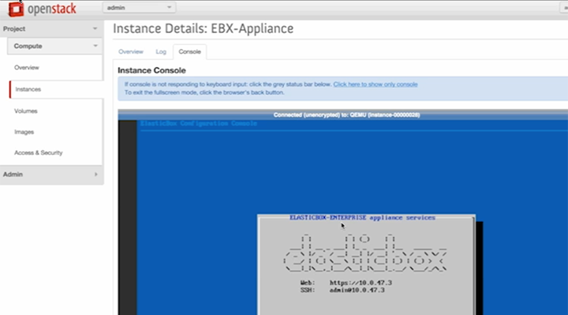

{{{
  "title": "Installing the ElasticBox Virtual Appliance in OpenStack",
  "date": "12-12-2016",
  "author": [],
  "attachments": [],
  "related_products": [],
  "related_questions": [],
  "preview" : "Step-by-step Instructions for Installing the Virtual Appliance in OpenStack",
  "thumbnail": "../images/elasticbox-openstack-virtual-appliance.png",
  "contentIsHTML": false
}}}

<iframe width="560" height="315" src="https://player.vimeo.com/video/121204949" frameborder="0" allowfullscreen></iframe>

### Introduction

Follow along this short how-to on installing the ElasticBox virtual appliance in OpenStack.

### Create a Flavor

First, you need to create a flavor in OpenStack. From the **Flavors** page in your OpenStack account, click **Create Flavor**.

In the **Flavor Info** tab, choose the following settings:
  * **Name:** EBX-Appliance
  * **ID:** auto
  * **VCPUs:** 2
  * **RAM MB:** 2048
  * **Root Disk GB:** 100
  * **Ephemeral Disk GB:** 0
  * **Swap Disk MB:** 0

Now click **Create Flavor**.

### Create an Image

Next, create an image in OpenStack. From the **Admin System Panel** in OpenStack, select **Images**. From the **Images** page, click **Create Image**.

In the popup, choose the following settings:

  * **Name:** EBX-Appliance
  * **Description:** ElasticBox Appliance
  * **Image Source:** Image Location
  * **Image Location:** Drop in the URL for the Image Location. Only images available via an HTTP UTRL are supported. The image location must be accessible to the Image Service. Compressed image binaries are supported (.zip and .tar.gz.) Note that this must be a valid and direct URL to the image binary. URLs that redirect or server error pages will result in unusable images.
  * **Format:** QCOW2 - QEMU Emulator
  * **Architecture:** It’s okay to leave this blank.
  * **Minimum Disk (GB):** Leave blank.
  * **Minimum RAM (MB):** Leave blank.
  * Select **Public**.
  * Leave **Protected** unselected.

Click **Create Image**.

### Launch an Instance

From the **Images** page, click **Launch** next to any active image.

In the **Launch Instance** popup, choose the following settings:
   * **Availability Zone:** Leave default selection.
   * **Instance Name:** EBX-Appliance
   * **Flavor:** EBX-Appliance
   * **Instance Count:** 1
   * **Instance Boot Source:** Boot from image.
   * **Image Name:** Will auto-populate from the Instance Name and Flavor you selected.

Click **Launch**.

From the **Instances** page, in the **Actions** dropdown for the EBX-Appliance, select **Associate Floating IP**.

Now click on the **EBX Appliance** instance and the console will open. Install complete!

