{{{
  "title": "Monitor and Report on Cloud Costs from ElasticBox",
  "date": "12-12-2016",
  "attachments": [],
  "related_products": [],
  "related_questions": [],
  "preview" : "Enable cloud reporting with ElasticBox for your enterprise to optimize cloud costs and avoid VM sprawl",
  "thumbnail": "../images/elasticbox-monitor1.png",
  "contentIsHTML": false
}}}

<iframe width="560" height="315" src="https://player.vimeo.com/video/111544299" frameborder="0" allowfullscreen></iframe>

### Introduction

Do you juggle massive bills from deploying to multiple clouds? Are your teams building applications without management and financial visibility? How do you control costs and encourage innovation at the same time? With ElasticBox, you can enable cloud reporting for your enterprise to optimize cloud costs and avoid VM sprawl. Catch trends, set custom pricing, and assign chargebacks for cost center budgets. Here’s a quick look at how it works.

### Monitor Which Cloud Provider is Deployed Most Frequently

Let’s say you want to know which cloud provider people in your organization deploy to most. Also which provider costs are highest in comparison to others.

As an ElasticBox Admin, head over to the **Admin Console**. Select **Providers** in the left navigation menu to access **Reports**, and select a time range. At a glance the **Overview** report shows can see which provider is most used and which costs most.

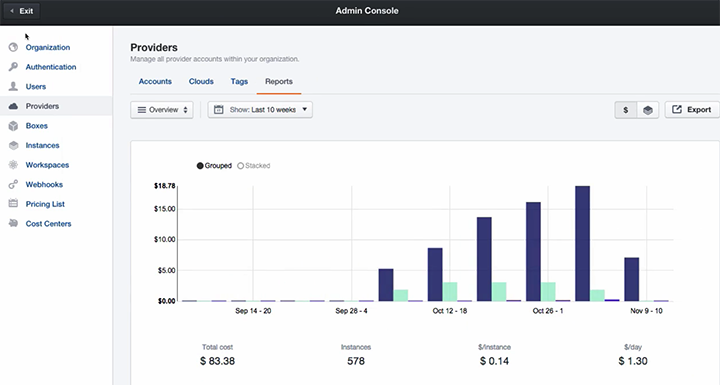

In this example, you can see that AWS is by far the most used. As a result, AWS expenditure is also the highest.

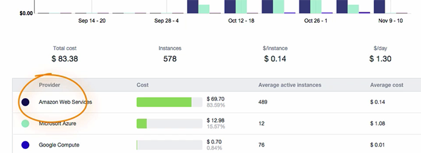

If you click on an AWS bar in the chart, you can drill down into how many instances were launched and when.

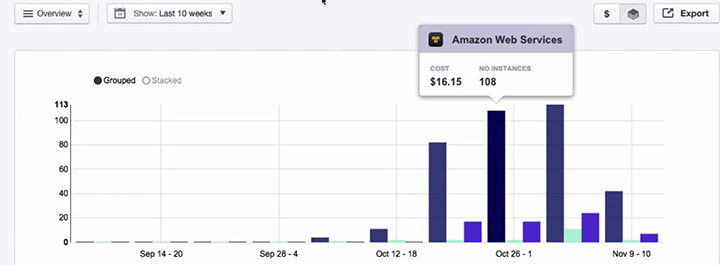

### Monitor Account Usage

To find out which accounts are most used, you can drill down into the report for any given provider.

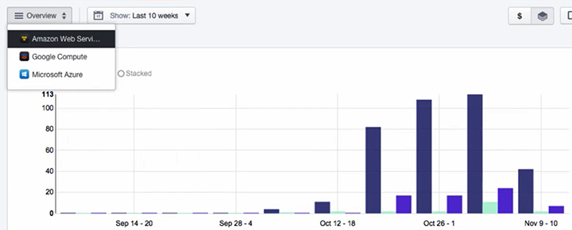

Select a date range, and the report shows top spenders for that account in that time frame.

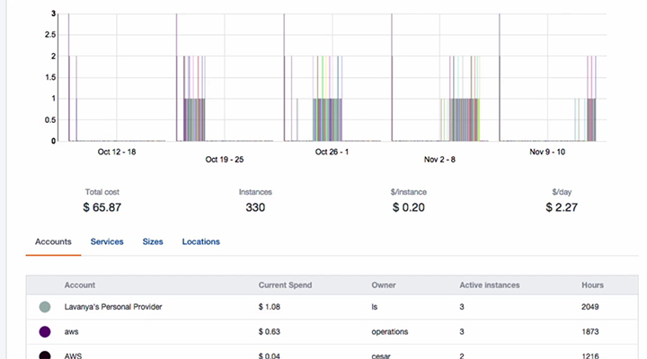

To view activity for just the top spending accounts, you can deselect the rest from **Account** list, and this will be reflected in the chart view.

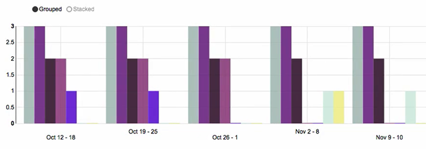

### Monitor Which Instance Types are Used Most

From the same view, select the **Sizes** tab under the chart. Here you can see the most used instance type for AWS is t2.micro.

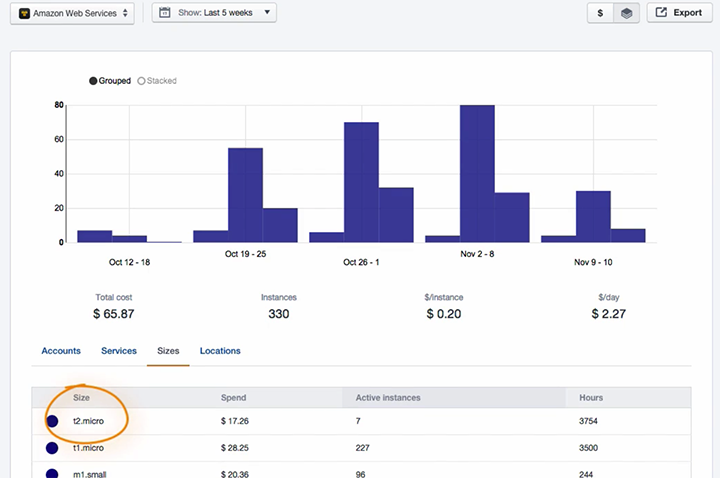

### Set Special Pricing

Let’s say you have a special company rate from AWS to save money on an instance type. You can have ElasticBox reflect custom pricing by selecting **Pricing List** in the left side navigation menu. Select **Amazon Web Services**, search for the instance name and enter the special rate. From now on, reports will calculate these instances by this custom rate.

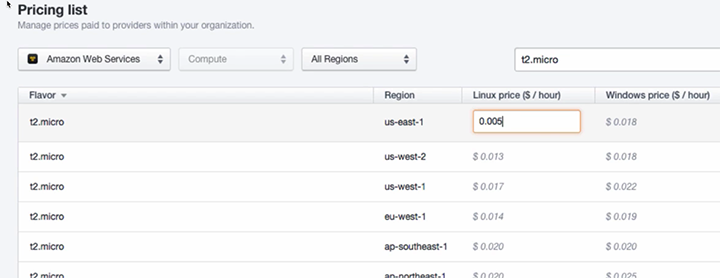

### Set Spending Quotas

You can also set quotas for how much different teams can spend per cost center. First click on **Cost Centers** in the side navigation. Here you can view all the Cost Centers that have been previously established.

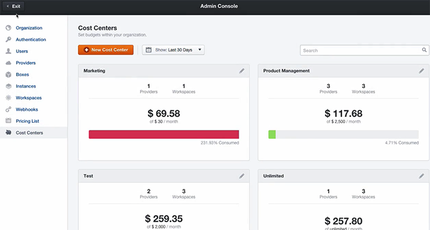

Click **New Cost Center** to create a new one. Here you give it a name, assign users and teams, and assign budget per provider account.

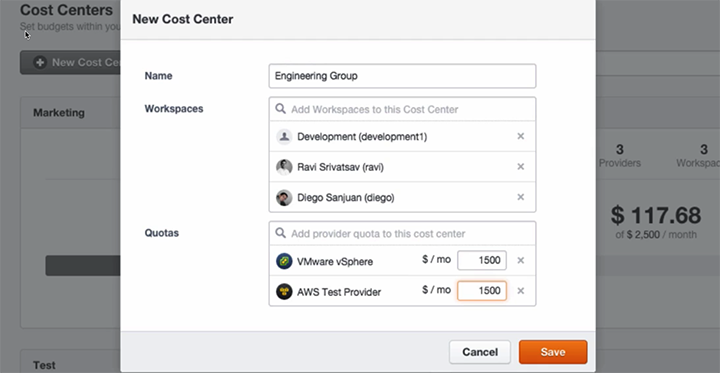

You can now track cost centers to see how actual expenditures in real-time compare to their monthly quota. If any team goes over 90% of their established quota, they’ll show up in red on the dashboard.

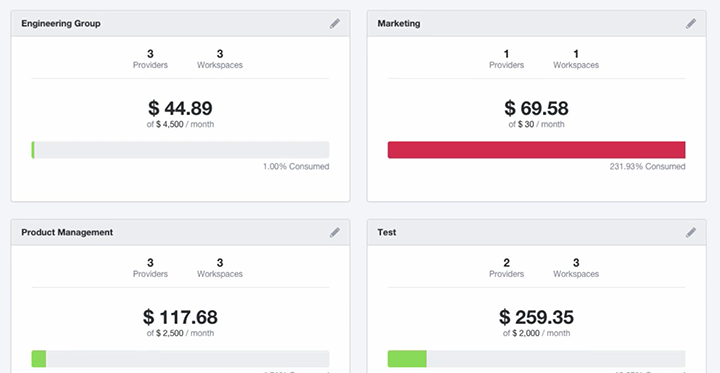
