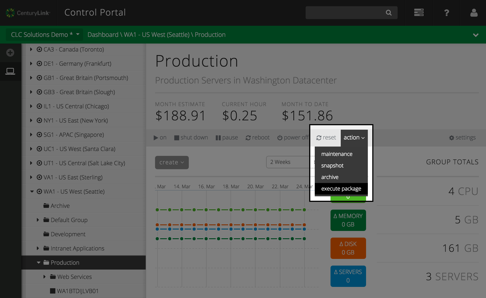
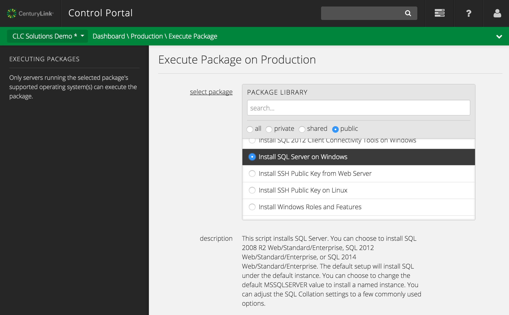
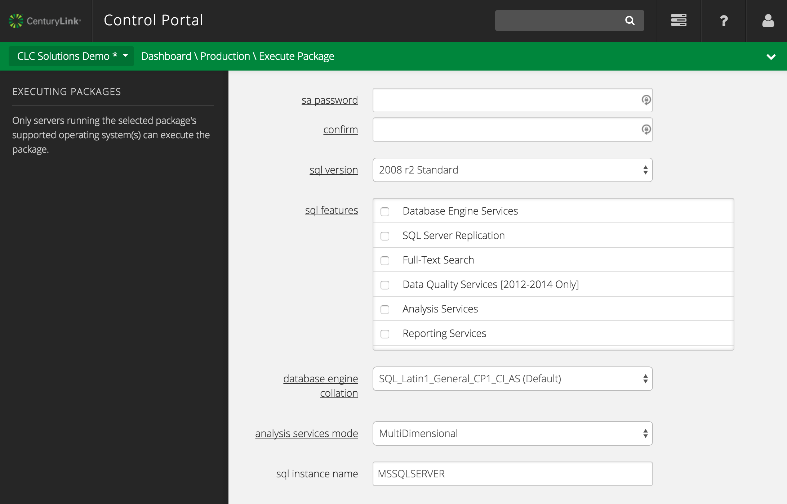
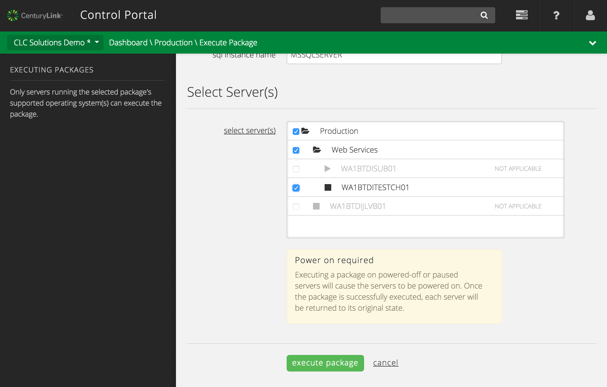

{{{
  "title": "Execute Package on Group of Servers",
  "date": "03-25-2015",
  "author": "",
  "attachments": [],
  "related_products": [],
  "related_questions": [],
  "preview" : "Script or install software on multiple servers at once by executing a package on any or all of the servers in a group.",
  "thumbnail": "../images/group-execute-package-preview.png",
  "contentIsHTML": false
}}}

<iframe width="560" height="315" src="https://www.youtube.com/embed/1abMaKA4yt8" frameborder="0" allowfullscreen></iframe>

### Introduction

CenturyLink Public Cloud users can easily run a script or install software on multiple servers at once by executing a package on any or all of the servers in a group. This is useful for performing tasks such as joining an entire set of servers to a domain, installing a new performance monitoring agent, or adding a software patch to a subset of machines.

Packages execute against servers whether they are running or not; for servers that are not running, the service puts the server into a running state, executes the package, then restores the server to its previous state.

Here are the steps to follow for executing a package on a group of servers using Control Portal:

### 1. Navigate to the Group Status

  Navigate to the group containing the servers you wish to execute the package on. In the **action** item in the power ops menu, select **execute package**.

  

### 2. Select a Package to Execute

  Select a package to apply to the servers in this groupYou can view all available packages,  search by name, or filter based on visibility. (For advanced users looking to create their own custom packages, instructions can be found in the [CenturyLink Knowledge Base](//www.centurylinkcloud.com/knowledge-base/blueprints/blueprints-script-and-software-package-management/).)

  

### 3. Enter Required Fields

  After selecting a package, the description will appear along with a place to enter values for all the parameters defined the package, if there are any. Fill out all the fields then continue to scroll down. (The example below shows the required fields for the "Install SQL Server on Windows" package.)

  

### 4. Select Servers

  Finally, select the server(s) that you'd like the package to run on. You may choose any or all servers under the given group's hierarchy provided they are running the selected package's supported operating system(s).

  

  Click **execute package** and a job will be added to the queue to execute the package on the selected servers.
