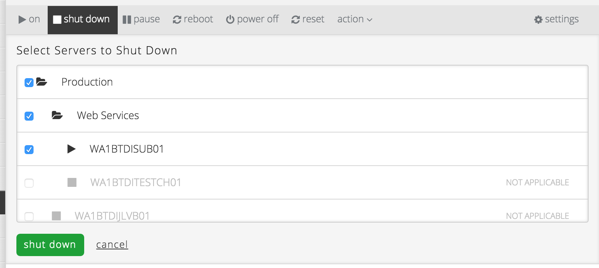

{{{
  "title": "Group Power Operations",
  "date": "03-18-2015",
  "author": "",
  "attachments": [],
  "related_products": [],
  "related_questions": [],
  "preview" : "",
  "contentIsHTML": false
}}}

Easily issue power commands against Groups of servers in the Control Portal. This makes it easy to quickly power off or reboot sets of servers with a single command.

#### On

Applies to servers that are powered off. Initiates the operating system boot sequence. Billing charges for memory, CPU, and operating system (if applicable) start accruing, and monitors are re-enabled.

#### Shut Down

Initiates a graceful shutdown of the corresponding server or servers. Like the “off” power command, all memory and CPU charges cease, monitors are disabled, and the machine is left in a powered off state.

#### Pause

When a server is paused, its state is frozen (e.g. memory, open applications) and monitoring ceases. Billing charges for CPU and memory stop. A paused machine can be quickly brought back to life by issuing the **On** power command. Any applicable operating system charges continue to accrue while a machine is paused.

#### Reboot

Executes a graceful reboot of the target server or servers. Unlike the forced “reset” power command, this instructs the operating system to initiate a proper stop and restart.

#### Power Off

Applies to This is a forced shutdown of a server. It’s the equivalent of unplugging a physical machine. All memory and CPU charges stop accruing, monitors are disabled, and the machine ends up in a powered off state. Any operating system charges (if applicable) and storage charges continue accruing. If the server is moved to archive storage, then any applicable operating system charges cease.

#### Reset

Similar to the relationship between **Off** and **Stop OS**, the reset command is a forced power off + power on combination. It is equivalent to the reset button on a physical computer.

#### Maintenance

This command puts a server or servers into maintenance mode which means that monitors are disabled.
