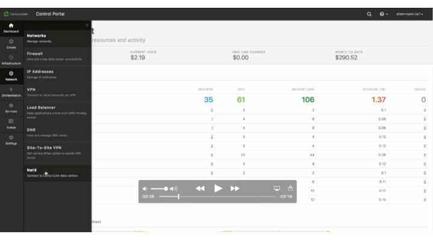
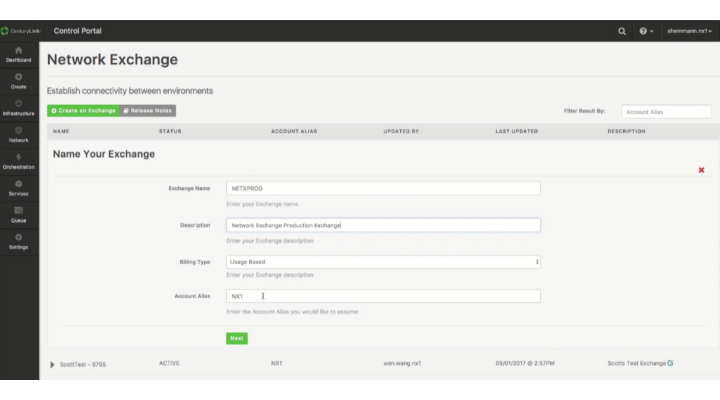
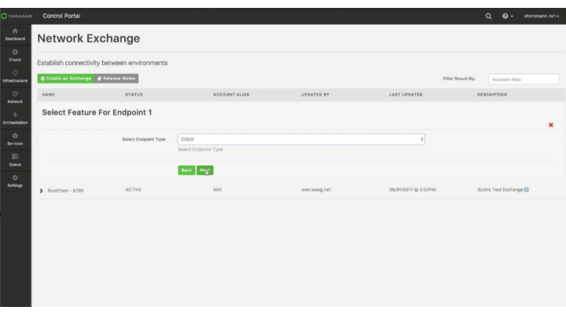
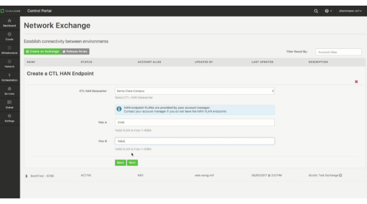
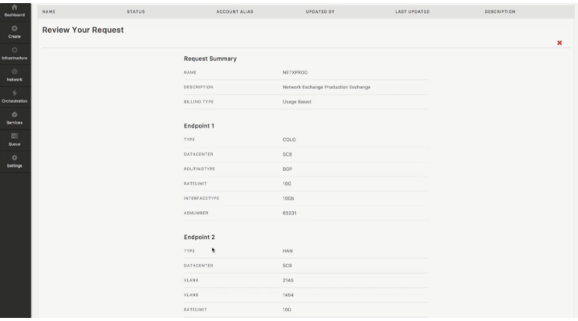
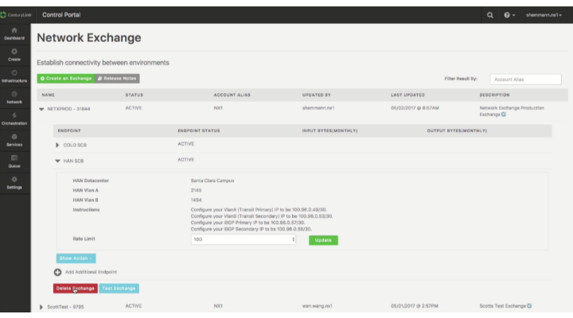

{{{
  "title": "Creating and Deleting an Exchange",
  "date": "05-09-2017",
  "author": "",
  "attachments": [],
  "related_products": [],
  "related_questions": [],
  "preview" : "Creating and Deleting a Colo to HAN Exchange",
  "thumbnail": "../images/creating-and-deleting-an-exchange-thumb.png",
  "contentIsHTML": false
}}}

<iframe width="560" height="315" src="https://player.vimeo.com/video/216019694" frameborder="0" allowfullscreen></iframe>

This video shows how to create and then delete a Colo to HAN exchange in the CenturyLink Cloud control portal.

### Introduction

Network Exchange provides a secure, high-speed, redundant, private network, with usage-based billing. It includes ease of setup and management of virtual circuits via the Control Portal, coupled with CenturyLink Platform automation and pre-deployed network infrastructure.

### Log-in to the CenturyLink Cloud Portal

Log-in to the Centurylink Cloud control portal using your ctl.io credentials.

Navigate to the Network Exchange satellite app by clicking **Network > NetX** on the left-hand navigation bar.

### Create an Exchange

On the Network Exchange screen, click **Create an Exchange**.

Name the exchange and add a description, a billing type, and the account alias. The account alias is tied to a specific CenturyLink Cloud account by default.

Click **Next**.

Choose the first endpoint type out of the available drop down list.

After you select your first endpoint, click next to fill in the details. Select the location and any other pertinent information on the screen.

Click **Next** to move on to the second endpoint.

Now choose the second endpoint type from the drop down list. Click **Next**.

Fill in the location and pertinent information for this endpoint.

Then click **Next**.

A Request Summary will appear. Review this to make sure the information is correct. Click **Back** to make changes or **Submit** to build the exchange.

The exchange will show a "BUILDING" status until it is complete. Then it will change to "ACTIVE."

Once active, you can view each endpoint by expanding the information under the exchange.

### Delete an Exchange

The delete the exchange, expand the listing and click **Delete Exchange**.

Verify that you want to delete it by clicking **Yes**.

The status of the exchange will show "DELETING" until is is complete. At that point the exchange is removed.
