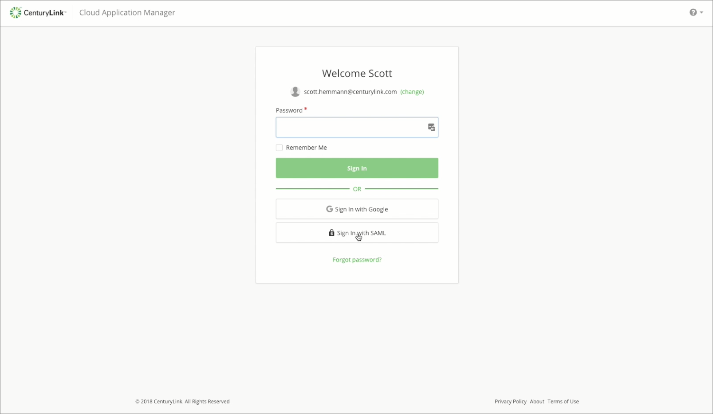
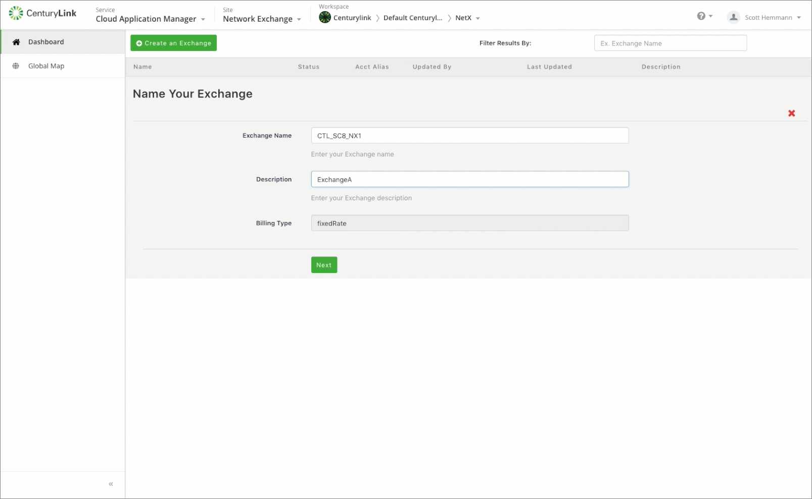
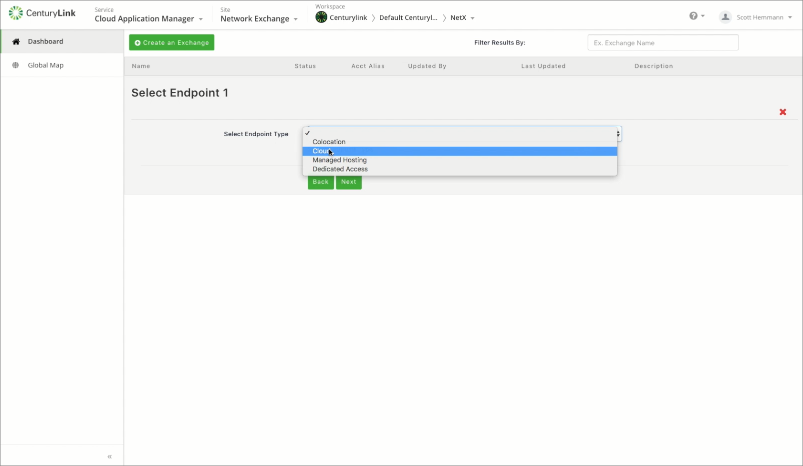
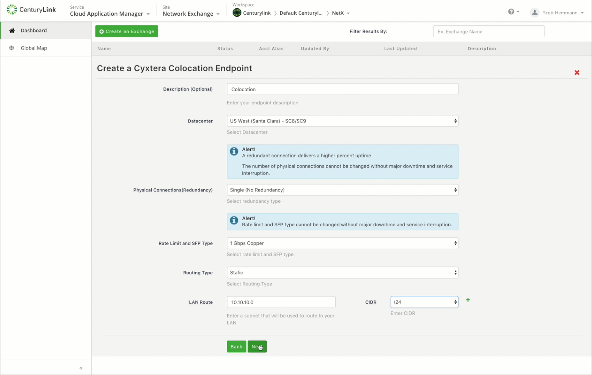
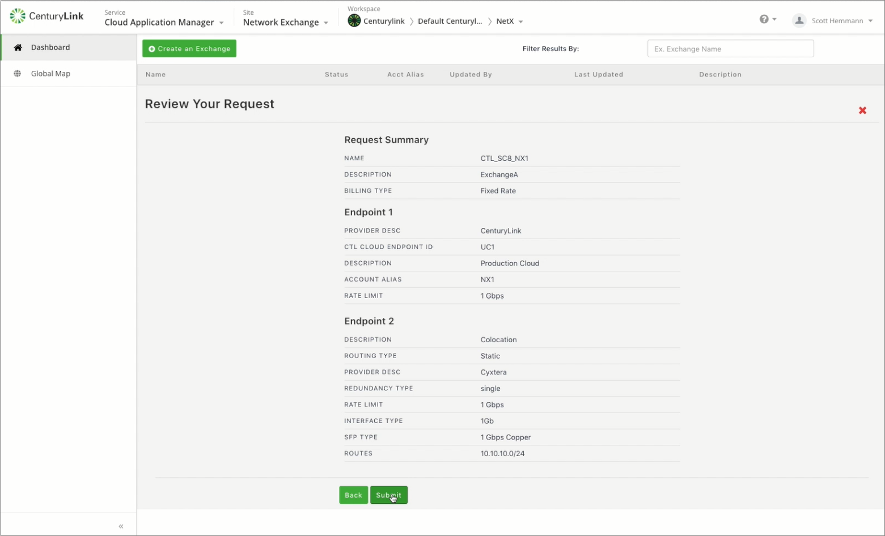
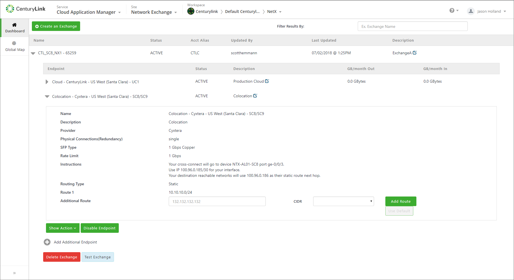

{{{
  "title": "Creating and Deleting an Exchange",
  "date": "07-09-2018",
  "author": "Jason Holland",
  "attachments": [],
  "related_products": [],
  "related_questions": [],
  "preview" : "Creating a CenturyLink Cloud to Colo Exchange",
  "thumbnail": "../images/network-exchange-clc-colo-video-image.png",
  "contentIsHTML": false
}}}

<iframe width="640" height="360" src="https://player.vimeo.com/video/280611150" frameborder="0" allowfullscreen></iframe>

This video shows how to create an Exchange with CenturyLink Cloud (CLC) and Colocation  Endpoints.

### Introduction

Network Exchange provides secure, high-speed, redundant, automated network connections between disparate IT environments allowing for a true hybrid environment. The Network Exchange portal allows for self-managed connections, including the creation, modification and deletion, via the portal, combined with automation via Software Defined Networking.

### Log-in to the CenturyLink Cloud Portal

Log-in to the Cloud Application Management (CAM) portal using your CAM credentials or your CenturyLink Cloud credentials.

### Create an Exchange

On the Network Exchange screen, click **Create an Exchange**.

Name the Exchange and add a description. The Billing Type for all Exchanges is Fixed Monthly.

Click **Next**.

Choose the Cloud endpoint type in the available drop down list.

After you select your first endpoint, click next to fill in the details. Select the location and any other pertinent information on the screen.

Click **Next** to move on to the second endpoint.

Now choose the second endpoint type from the drop down list. Click **Next**.

Fill in the location and pertinent information for this endpoint.

Then click **Next**.

A Request Summary will appear. Review this to make sure the information is correct. Click **Back** to make changes or **Submit** to build the exchange.

The exchange will show a "BUILDING" status until it is complete. Then it will change to "ACTIVE."

Once active, you can view each endpoint by expanding the information under the exchange.

### View Colocation Connection Instructions

To view the Colocation Endpoint connection instructions, expand the new Exchange and then expand the Colocation Endpoint.

