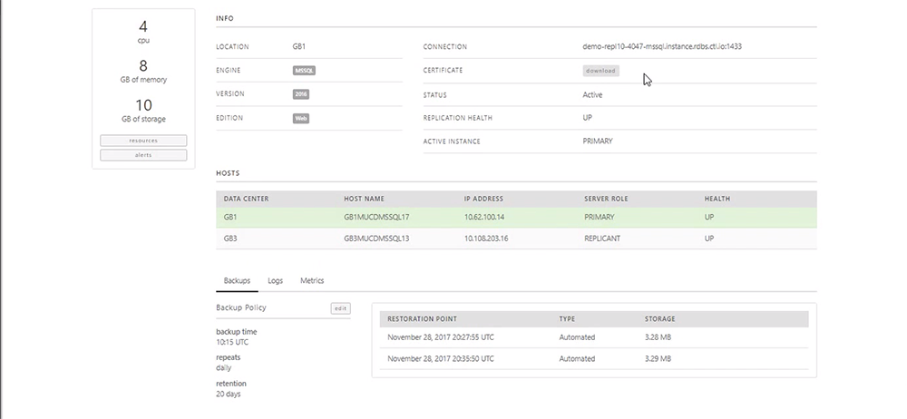
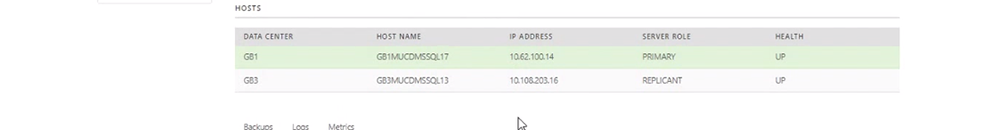
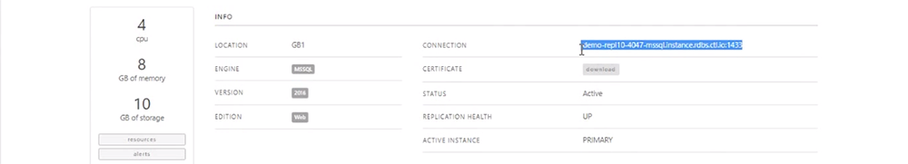
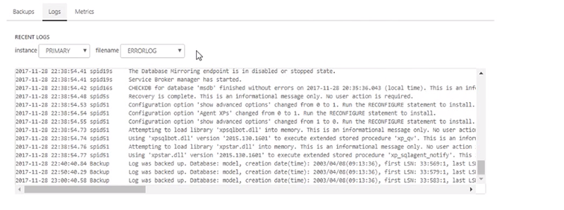
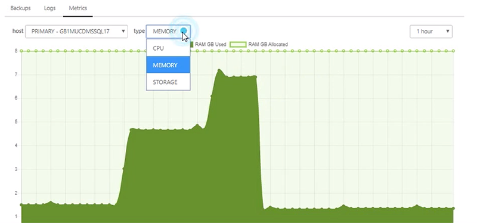

{{{
  "title": "Configuring an MSSQL Server Relational Database",
  "date": "01-22-2019",
  "author": "",
  "attachments": [],
  "related_products": [],
  "related_questions": [],
  "preview" : "How to configure an MSSQL Server Relational Database",
  "thumbnail": "../images/configure-relational-db-preview.png",
  "contentIsHTML": false
}}}

<iframe width="560" height="315" src="https://player.vimeo.com/video/255619790" frameborder="0" allowfullscreen></iframe>
 
 

This video series shows how to quickly create a Microsoft SQL Server Relational Database. In Part 2, we will demonstrate configuring a database and reviewing logs.

### Introduction

The Microsoft SQL Server (MS-SQL) database is a comprehensive and integrated data management and analysis software application that enables the reliable management of mission-critical information. With a Relational DB, you can create, modify, and delete tables, as well as select, insert, and delete data from existing tables.

### Configuring Your Database

After the database is built and the replication is running, you can review information about your database and the hosts involved in your replication.

You can also download your SSL certificate, configure your backups, and view your logs and metrics.

Under the Hosts section, the green background denotes the active database that you are connected to. The host name and IP address are included here for clarification, but the connection will always be made through the Connection string in the Info section above.

That connection string goes to a DNS server and allows it to switch seamlessly on failovers.

Logs stream in near real-time. There are two dropdowns that allow you to view logs from either the primary or replicant database.

You can also select the Metrics tab here to view data for Memory, CPU and Storage over 1-hour, 1-day and 31-day periods.

**Part 3:** [Logging Into an MSSQL Server Relational Database](../Relational DB Service/3-login-relational-db-mssql.md)
