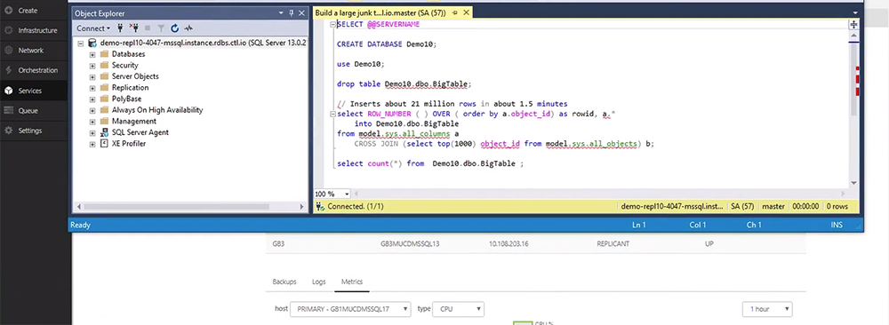

{{{
  "title": "Logging Into an MSSQL Server Relational Database",
  "date": "01-22-2019",
  "author": "",
  "attachments": [],
  "related_products": [],
  "related_questions": [],
  "preview" : "Logging into an MSSQL Server Relational Database",
  "thumbnail": "../images/login-relational-db-preview.png",
  "contentIsHTML": false
}}}

<iframe width="560" height="315" src="https://player.vimeo.com/video/255620675" frameborder="0" allowfullscreen></iframe>
 
 
This video series shows how to quickly create and configure a Microsoft SQL Server Relational Database. In Part 3, we will demonstrate logging in and running a stress test.

### Introduction

The Microsoft SQL Server (MS-SQL) database is a comprehensive and integrated data management and analysis software application that enables the reliable management of mission-critical information. With a Relational DB, you can create, modify, and delete tables, as well as select, insert, and delete data from existing tables.

### Logging In

Open your VPN connection to log into your MSSQL Server management studio.

If they're not preloaded, enter your Server Type, Server Name, Authentication, Login and Password in the appropriate dropdowns.

### Running a Stress Test

Create a table in the management studio to run a stress test.

Check to make sure you are on the active server.

Add rows and select *Execute*.

CPU and Memory will spike during the test. Storage remains the same in our test because it has been allocated to previous tests.

**Part 4:** [Failover for an MSSQL Server Relational Database](../Relational DB Service/4-failover-for-relational-db-mssql.md)
