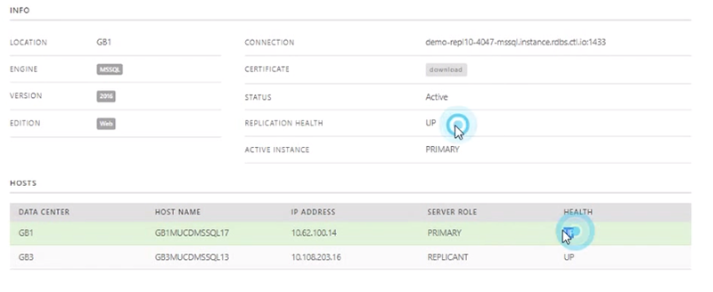
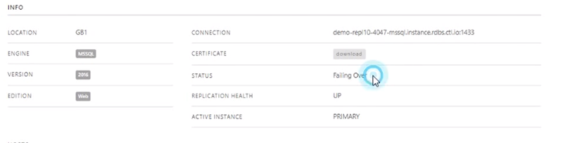
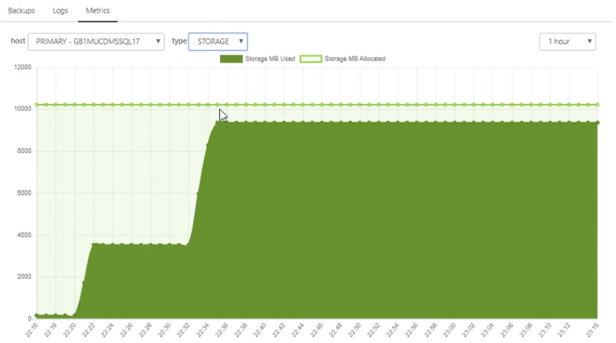
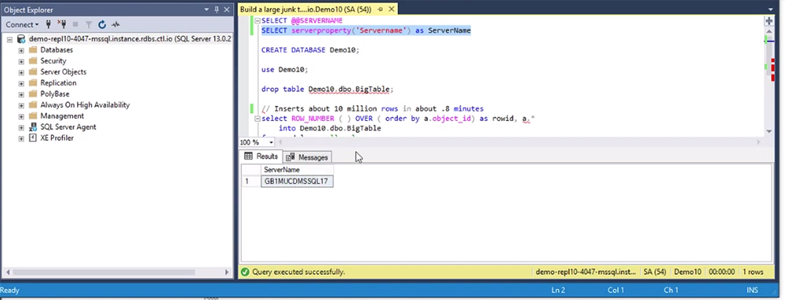

{{{
  "title": "Failover for an MSSQL Server Relational Database",
  "date": "01-22-2019",
  "author": "",
  "attachments": [],
  "related_products": [],
  "related_questions": [],
  "preview" : "Failover for an MSSQL Server Relational Database",
  "thumbnail": "../images/failover-relational-db-preview.png",
  "contentIsHTML": false
}}}

<iframe width="560" height="315" src="https://player.vimeo.com/video/255622847" frameborder="0" allowfullscreen></iframe>
 
 

This video series shows how to quickly create a Microsoft SQL Server Relational Database. In Part 4, we will demonstrate failover capabilities.

### Introduction

The Microsoft SQL Server (MS-SQL) database is a comprehensive and integrated data management and analysis software application that enables the reliable management of mission-critical information. With a Relational DB, you can create, modify, and delete tables, as well as select, insert, and delete data from existing tables.

### Failover

View the failover capabilities of your MSSQL Relational Database, by choosing *Failover* at the top of the management studio. You may see a warning about a potential data loss — this is a general warning so unsaved transactions aren't lost when you perform a failover.

As long as your servers are up under *Health* in the Hosts section and *Replication Health* in the Info section, all transactions should be synched.

When Failover begins, the *Status* in the Info section will change to Failing Over. At this point, your DNS record will change from one to the other.

Storage will also change to the active replicant server from the previously active primary server.

Repeat the steps to fail back to the original server, execute the query to view the database that's up, and the test is complete.
