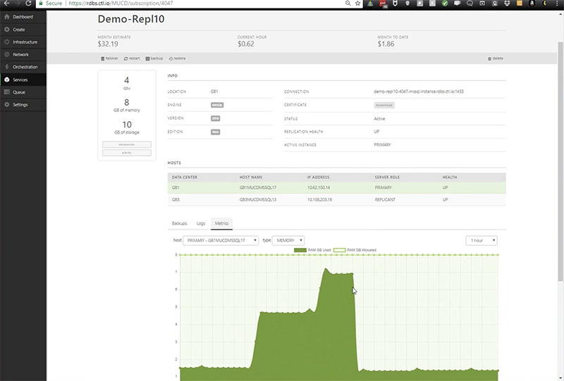
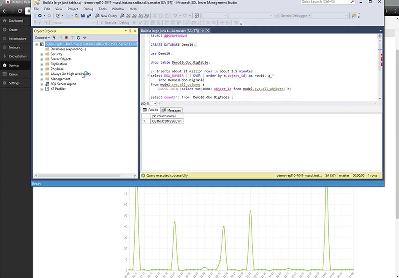
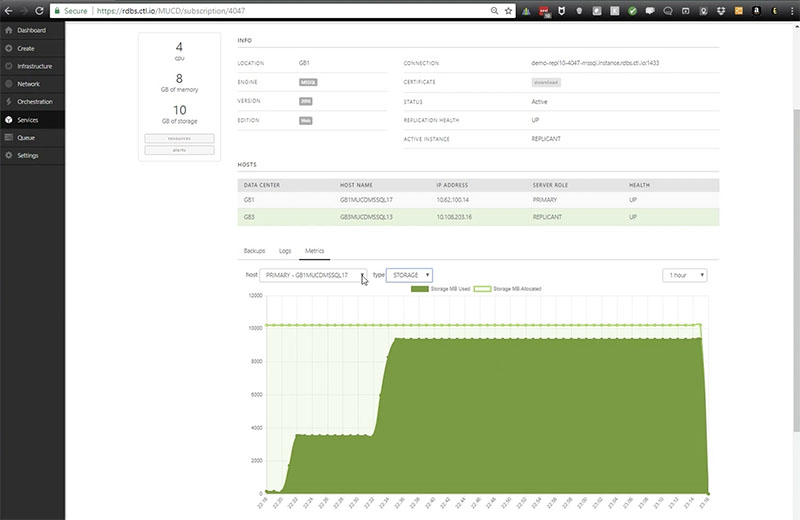

{{{
  "title": "Creating an MSSQL Server Relational Database",
  "date": "03-15-2018",
  "author": "",
  "attachments": [],
  "related_products": [],
  "related_questions": [],
  "preview" : "How to create an MSSQL Server Relational Database",
  "thumbnail": "../images/mssql-server-relational-db-preview.png",
  "contentIsHTML": false
}}}

This video series shows how to quickly create a Microsoft SQL Server Relational Database.

### Introduction

The Microsoft SQL Server (MS-SQL) database is a comprehensive and integrated data management and analysis software application that enables the reliable management of mission-critical information. With a Relational DB, you can create, modify, and delete tables, as well as select, insert, and delete data from existing tables.

### Creating a Relational DB

There are two ways to create a relational database from the DBaaS dashboard. You can click *Create* in the left-hand menu, then select *Relational DB*, or you can select *Services* and then *Relational DB*. This method will take you to a list of your existing databases, where you can create a new one by clicking on the green button at the top of the page.

### Configuring Your DB

After the database is built and the replication is running, you can review information about your database and the hosts involved in your replication. You can also download your SSL certificate, configure your backups, and view your logs and metrics.

### Logging In

Logging into your MSSQL Relational Database and running a stress test.

### Failover

Demonstrating the failover capabilities of your MSSQL Relational Database.
