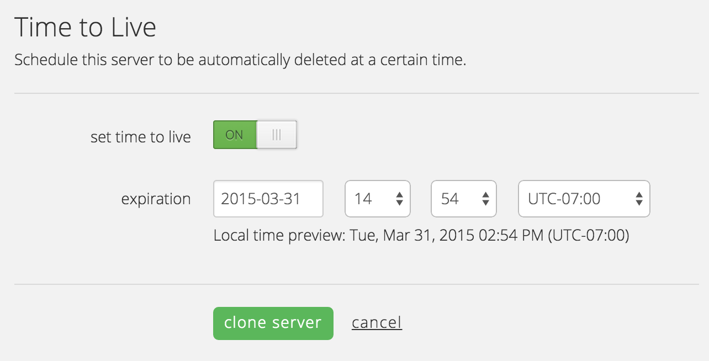

{{{
  "title": "Clone a Server",
  "date": "04-02-2015",
  "author": "",
  "attachments": [],
  "related_products": [],
  "related_questions": [],
  "preview" : "Make an exact copy of an existing server.",
  "thumbnail" : "../images/servers-clone-preview.png",
  "contentIsHTML": false
}}}

<iframe width="560" height="315" src="https://www.youtube.com/embed/z-fD4nn7x0E?rel=0&amp;showinfo=0" frameborder="0" allowfullscreen></iframe>

### Introduction

Cloning a server takes an exact copy of an existing machine. A cloned server is, for most purposes, an exact copy of the source; however, certain underlying settings are changed (UUID, MAC, SID, etc.). Cloning is an easy way to produce alternate copies of existing infrastructure – common use cases are migrating servers from “test” to “development” or adding another web server to an existing stack.

### Clone a Server

Once you've navigated to the server you wish to clone, select the **action** menu option. From the list, select **clone**, which will direct you to the Clone Server form.

The cloning process is very similar to the steps taken to create your original server. However the location, operating system and resources options have been removed. The origin servers' resources will be applied to the cloned server.

Complete the basic information by giving the new server a Name, Description & Root Password. Select the account network, primary DNS and secondary DNS for this server. Accounts can have multiple networks within a particular data center.

### Server Lifespan (Time To Live) (Optional)

We recognize that sometimes server lifespans should coincide with a project lifespan, so we offer an optional time-to-live that allows you to schedule when the server should automatically be deleted. Setting a time to live results in a new Scheduled Task added to the server. If you need to extend the life of the server, this scheduled task can be changed after the server is provisioned.

### Queue The Clone Server Build

Confirm your cloned server settings, then select the **clone server** button to queue the server build. Once the server is built, it will appear in the group that you selected.

Congratulations, you’ve successfully cloned a server on the CenturyLink Platform!
