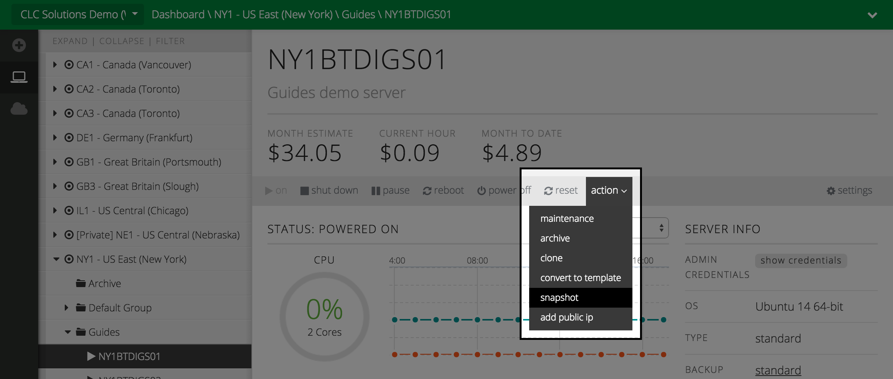
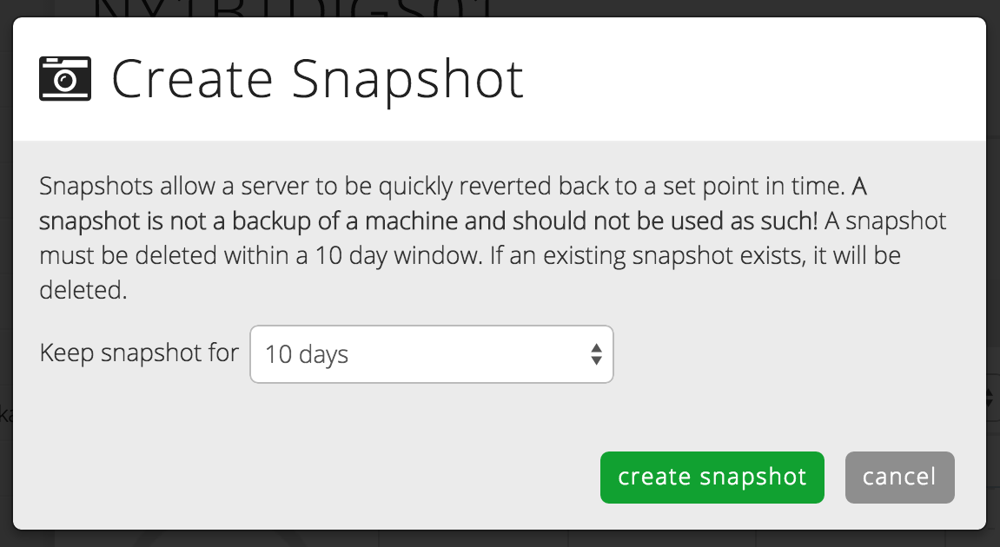
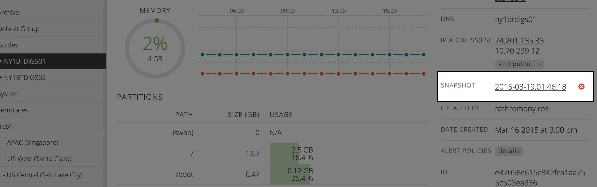
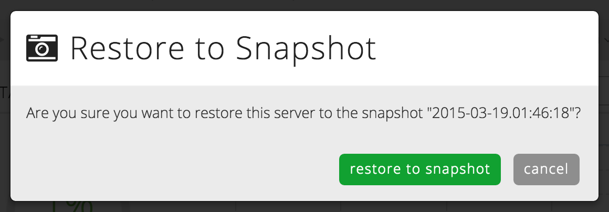

{{{
  "title": "Server Snapshot",
  "date": "04-05-2015",
  "author": "",
  "attachments": [],
  "related_products": [],
  "related_questions": [],
  "preview" : "Snapshot a server to so that it may quickly be reverted to a set point in time.",
  "thumbnail" : "../images/servers-snapshot-preview.png",
  "contentIsHTML": false
}}}

<iframe width="560" height="315" src="https://www.youtube.com/embed/We87qlVIgQw?rel=0&amp;showinfo=0" frameborder="0" allowfullscreen></iframe>

### Introduction

Snapshots allow a server to be quickly reverted back to a set point in time. This can be very useful if you want to perform a short term test or configuration changes. However, due to the way that snapshots operate, a snapshot is not a backup of a machine and there is a 10 day max life of a snapshot.

### Navigate to Server

  Once you've navigated to the server you'd like to snapshot, select **snapshot** from the **actions** drop down in the power bar.

  

### Snapshot Lifespan

  A dialog will appear where you'll need to select the number of days you wish to retain the snapshot. If a snapshot already exists, it will be replaced by the new snapshot &mdash; a server can only have a single snapshot at a time.

  

  Select the **create snapshot** button in the dialog window, and the snapshot will be queued.

### Existing Snapshot

  Once the snapshot has been taken, it will appear in the **Server Info** column on the right side of the server status page. The name of the snapshot reflects the date and time the snapshot was taken.

  

### Restore a Snapshot

  To restore the snapshot, select the snapshot name. A **Restore From Snapshot** dialog window will ask you to confirm the restoration. Selecting the **restore from snapshot** button will queue the restoration process. When the restore process is complete, your server will be restored to the state when the snapshot was taken.

  

  Congratulations, you've just taken and restored a server snapshot!

  For more information on snapshots, check out these articles in the [CenturyLink Knowledge Base](http://www.centurylinkcloud.com/knowledge-base/).

* [Creating and Managing Server Snapshots](http://www.centurylinkcloud.com/knowledge-base/servers/creating-and-managing-server-snapshots/)
* [Group Snapshots](http://www.centurylinkcloud.com/knowledge-base/servers/group-snapshots/)
