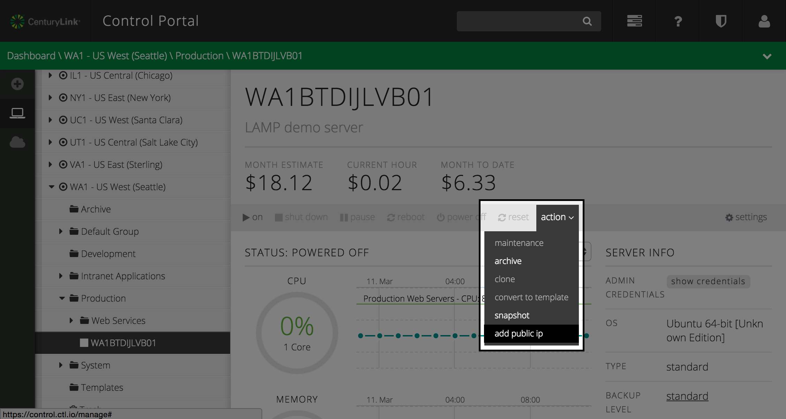

{{{
  "title": "Add a public IP",
  "date": "04-03-2015",
  "author": "",
  "attachments": [],
  "related_products": [],
  "related_questions": [],
  "preview" : "Make your server accessible via the public internet by adding a public ip.",
  "thumbnail" : "../images/servers-public-ip-preview.png",
  "contentIsHTML": false
}}}

<iframe width="560" height="315" src="https://www.youtube.com/embed/zPONIrlHRms?rel=0&amp;showinfo=0" frameborder="0" allowfullscreen></iframe>

### 1. Navigate to Server Status

  Navigate to the server you wish to add a public ip address to. In the **action** item in the power ops menu, select **add public ip**.

  

### 2. Enter Public IP Settings

  The **Add Public IP Address** form will appear. Enter values in the appropriate fields that will meet your needs. In the form, you can specify which multiple single port, port ranges and CIDR Source IP ranges to open.

  

  **Internal IP Address:** By default the internal IP address of the server will be selected. As the CenturyLink Public Cloud leverages a 1 to 1 NAT the public IP will be mapped to this private IP. Should you require more than 1 public IP on a server, the same process applies except when visiting the GUI the internal IP address field will show 'Add new IP address."  During the provisioning of the 2nd Public IP, as we use 1 to 1 NAT, a new private IP will also be bound to the server.

  ** Public Port(s):**  A fixed, defined list of frequently used TCP ports customers can simple select from to save time.

  **Single Port:** A specific TCP or UDP port for an application service

  **Port Range:** A specific range of TCP or UDP ports for an application service

  **Restrict Source Traffic:** A flag that allows you to input a source IP filter on the public IP. If this is not enabled, any ports defined will be accessible by anyone on the public internet.

  **Source IP (CIDR):**  The list(s) of source IP or IP Ranges with defined TCP or UDP ports, in CIDR format. All other traffic will be blocked. Please see http://en.wikipedia.org/wiki/Classless_Inter-Domain_Routing or http://www.ipaddressguide.com/cidr for more details on proper format of CIDR ranges in the interface.

  Finally, select the **add public ip address** button and an publicly accessible ip address/port combination will be added to your server.
