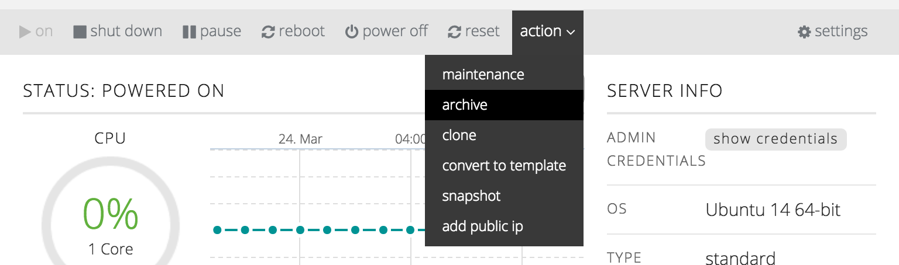
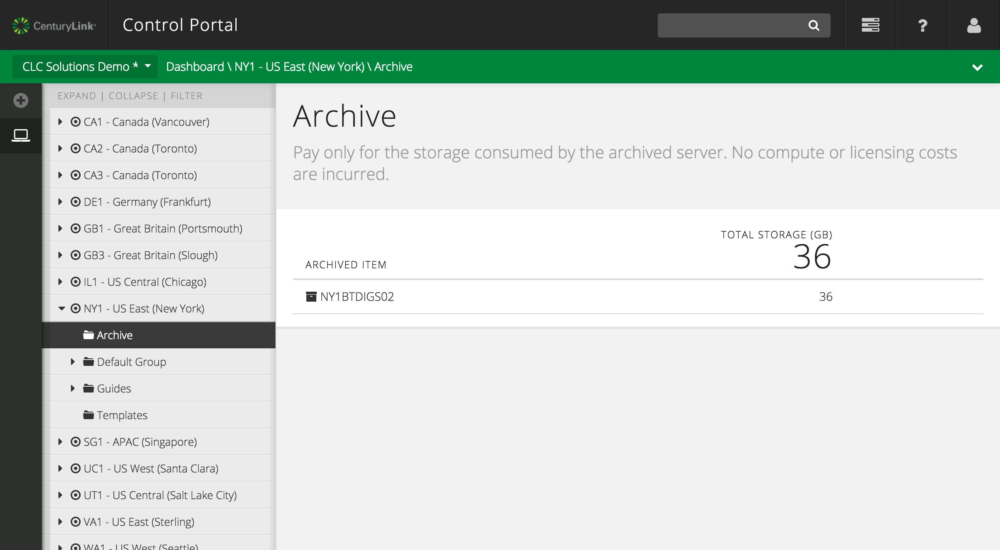

{{{
  "title": "Archive a Server",
  "date": "03-20-2015",
  "author": "",
  "attachments": [],
  "related_products": [],
  "related_questions": [],
  "preview" : "Archive a server to suspends the operating system and migrate the instance to a less costly storage tier.",
  "thumbnail" : "../images/servers-archive-preview.png",
  "contentIsHTML": false
}}}

### Introduction

Archiving a server suspends the operating system and migrates the instance to a less costly storage tier. However, it should be noted that bringing a server out of an archive state can take a few hours, so *archive* should not be used as a means for controlling costs if the server needs to change state quickly.

An example use case for *archive* would be if a business department has a reporting server that pulls data on a monthly basis from a 3rd party, and generates reports for business analysis. This server is required only two days per month and is otherwise unused. To save costs, the IT department schedules the server to be placed in archive and brought out of archived for operation during just these two days of the month.

### Archive a Server

  Once you've navigated to the server you wish to clone, select the **action** menu option. From the list, select **archive**, which will direct you to the Clone Server form.

  

  Confirm that you wish to archive the server in the dialog box that appears.

  

  You will then be directed to the queue. Once the archive process is completed, your archived server will appear in the **Archive** group in the data center that you archived the server in.

  In the archive state, you are responsible for archival storage costs consumed by the virtual machine (at a reduced rate). Compute, memory and licensing costs are not levied.

### Unarchive a Archived Server

  To unarchive the server, simply select the archived server, revealing a form where you can select which group to place the unarchived server in.

  

  Once the unarchiving process is complete, the server will be restored to it's original state in the server group you selected.

  Congratulations, you’ve successfully archived and unarchived a server on the CenturyLink Cloud!
