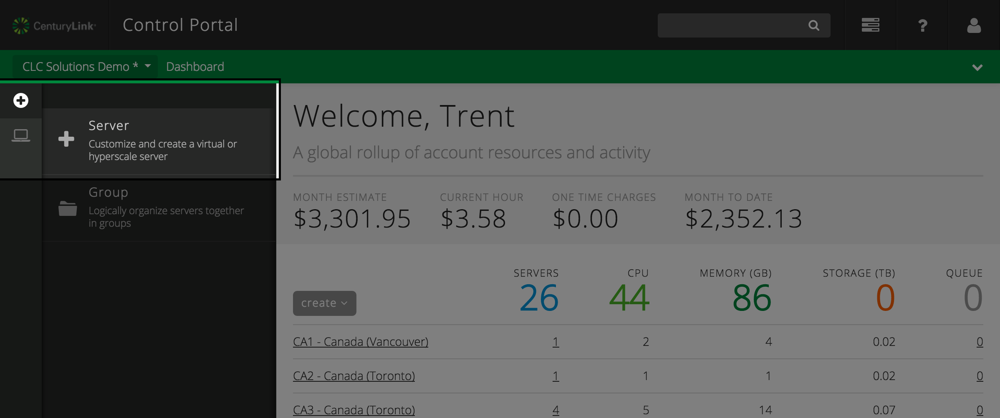
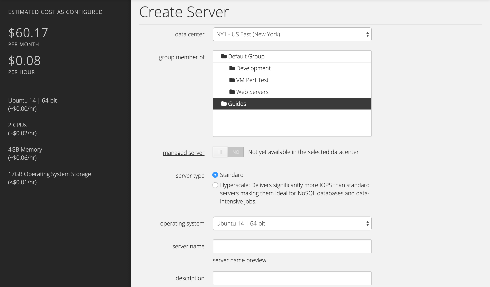
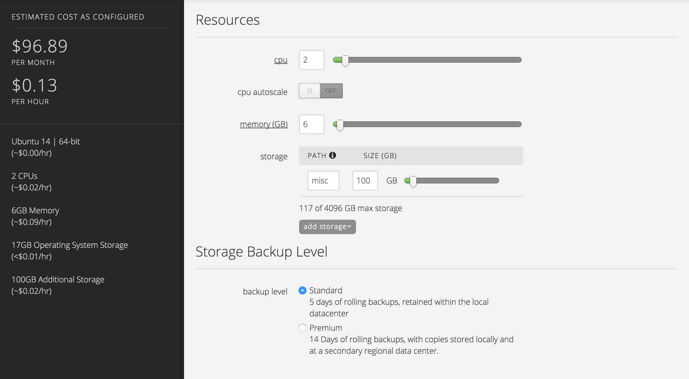
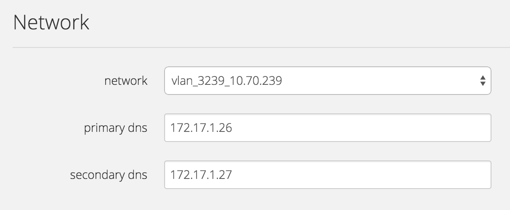

{{{
  "title": "Create Custom Server",
  "date": "04-10-2015",
  "author": "",
  "attachments": [],
  "related_products": [],
  "related_questions": [],
  "preview" : "Create a server with your exact resource specifications, network and optional time-to-live.",
  "thumbnail" : "../images/servers-create-preview.png",
  "contentIsHTML": false
}}}

<iframe width="560" height="315" src="https://www.youtube.com/embed/-0ZZXo6SQWU?rel=0&amp;showinfo=0" frameborder="0" allowfullscreen></iframe>

### Introduction

At the heart of the CenturyLink Platform is the ability to create and manage virtual infrastructure. This guide will demonstrate how to provision a new cloud server in the CenturyLink Cloud Control Portal.

### 1. Navigate to the Create Server Form

  There are many places to navigate to the **Create Server** page, but for this demo we'll use the create pane on the dashboard of the Control Portal. Select the "+" icon on the left of the interface, and then select **Server**.

  

### 2. Location, Type, Name and Password

  From top to bottom, the Create Server form will walk you through the required steps to successfully provision a new server in the CenturyLink Cloud Control Portal.

  Choose a **data center** location for your server that's appropriate for your application. Depending on the chosen data center location, additional services &mdash; [Managed Services](http://www.centurylinkcloud.com/managed-services/) and [Hyperscale Server](http://www.centurylinkcloud.com/hyperscale) for example &mdash; will be enabled/disabled based on whether it's available in the selected data center. Then select the **group** to place that server in (the server can be moved to a different group later).

  

  Select the server type ([Standard](http://www.centurylinkcloud.com/servers) or [Hyperscale](http://www.centurylinkcloud.com/hyperscale)), operating system template and enter a name for the server. If you have created custom templates in your account, they will be available in the operating system dropdown list as well. Note that the price per hour changes based on the selected operating system licensing cost.

### 3. Server Resources

  Specify CPU and memory allocation using the input box or slider. As resource values are changed, the estimated hourly and monthly prices will reflect those changes. Note, we can not foresee how you will utilize the server resource (for example, your server maybe powered off), this estimate isn’t a guarantee of actual costs, and is meant to provide a base level of pricing transparency. If after a period of time you find that you need to increase or decrease resources, they can be changed after the server is provisioned.

  

  If you’ve selected an operating system that supports CPU Autoscale, and you have a already defined a CPU Autoscale Policy, that will be available for selection. CPU Autoscale makes it possible to scale servers vertically based on utilization, ensuring optimal deployment of resources for cloud environments under a variety of conditions.

  Add storage disks to the server up to platform maximums based on server type. Storage disks can be expanded, added, and removed after the server is built. Choosing a Partition results in a formatted disk in the operating system. Raw Disk provides an unformatted volume.

  Select a CPU Autoscale Policy making it possible to scale servers up and down based on utilization ensuring optimal deployment of resources for cloud environments under a variety of conditions.

  For standard server types, select an appropriate backup level for your new virtual machine. With Hyperscale servers, there is no built in storage redundancy or snapshot capability. You are responsible for any storage backups for Hyperscale servers.

### 4. Network

  Select the account network, primary DNS and secondary DNS for this server. Accounts can have multiple networks within a particular data center.

  

### 5. Server Lifespan (Time To Live)

  We recognize that sometimes server lifespans should coincide with a project lifespan, so we offer an optional time-to-live that allows you to schedule when the server should automatically be deleted. Setting a time to live results in a new [Scheduled Task](http://www.centurylinkcloud.com/scheduling) added to the server. If you need to extend the life of the server, this scheduled task can be changed after the server is provisioned.

### 6. Queue The Server Build

  Confirm your server settings, then select the **create server** button to queue the server build. Once the server is built, it will appear in the group that you selected it be placed. Congratulations, you’ve successfully built a new virtual server on the CenturyLink Platform!
