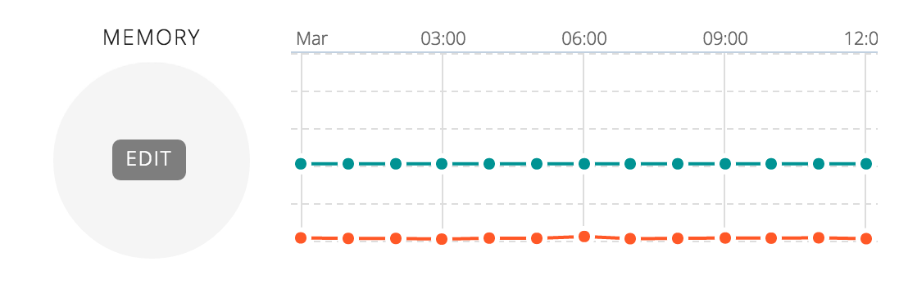
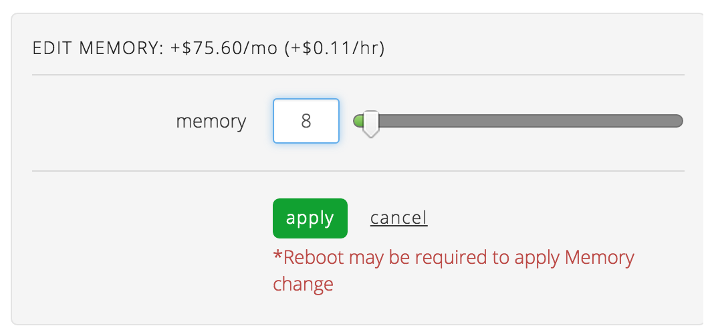

{{{
  "title": "Edit Memory on a Server",
  "date": "03-05-2015",
  "author": "",
  "attachments": [],
  "related_products": [],
  "related_questions": [],
  "preview" : "",
  "contentIsHTML": false
  }}}

Whether you’re taking a development server into production, or facing a seasonal-related traffic spike, you may need to adjust the memory or memory resources allocated to your server. Here's how to do it through the Control Portal.

## Edit Memory on a Server

Once you've navigated to the server who's memory allocation you wish to edit, hover over the memory count and the edit button will appear.

Select the edit button to enter the desired memory allocation for your server in the textbox provided. You can also use the slider to increase or decrease the value.

The estimated price per month of the server, as well as the per hour price difference is displayed to show how the change may effect the cost of the server.

Once you’re satisfied with your entry, select the ‘apply’ button. Depending on your edits a reboot may be required for change to take affect.
