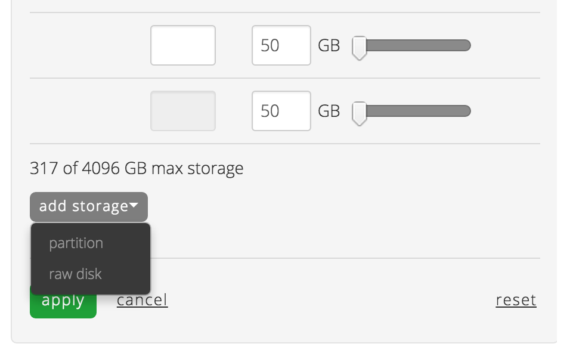

{{{
  "title": "Resize Disk",
  "date": "04-06-2015",
  "author": "",
  "attachments": [],
  "related_products": [],
  "related_questions": [],
  "preview" : "Add storage to a drive, or add additional disks to an existing server.",
  "thumbnail" : "../images/servers-edit-disk-preview.png",
  "contentIsHTML": false
}}}

<iframe width="560" height="315" src="https://www.youtube.com/embed/2b2qnaBPDZM?rel=0&amp;showinfo=0" frameborder="0" allowfullscreen></iframe>

### Introduction

During the lifespan of your server you may be faced with conditions that require you to adjust the size of existing disks, or add or delete disk partitions of your cloud server. Here's how to resize a disk through the Control Portal.

### Edit Existing Storage

Once you've navigated to the server whose storage allocation you wish to edit, select the **edit storage** button.

For the disk you want to increase (shrinking a disk is not supported), use the text box or slider provided to adjust the disk or partition's storage to the correct value. Once you’ve confirmed the value, click the apply button to implement your change. The estimated price per month of the server, as well as the per hour price difference, will be displayed to show how the change may effect the cost of the server.

Once you’re satisfied with your changes, select the ‘apply’ button. A reboot may be required for the changes to take affect.

### Add Raw Disk Storage Or Partition

Move the mouse’s cursor over the add storage label & a menu will appear displaying the add Partition or Raw Disk options.  Select the option appropriate for your change.  If you select to add a Partition, enter the ID & correct size by using the textbox or slider provided.  If you choose to the Raw Disk selection, an ID will be provided for you.

### Delete Existing Storage

**Before deleting any drive or partition you will want to ensure you do not delete your system drive. By default the system drive is assigned the ID of 0:0.**

Move your cursor over the disk you wish to remove and a "x" icon will appear on the right side of the storage table. Click the delete button and confirm your decision by clicking the **apply** button.

