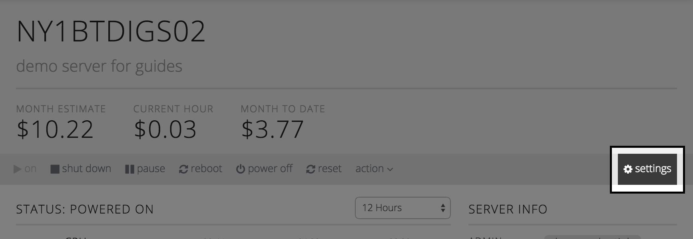
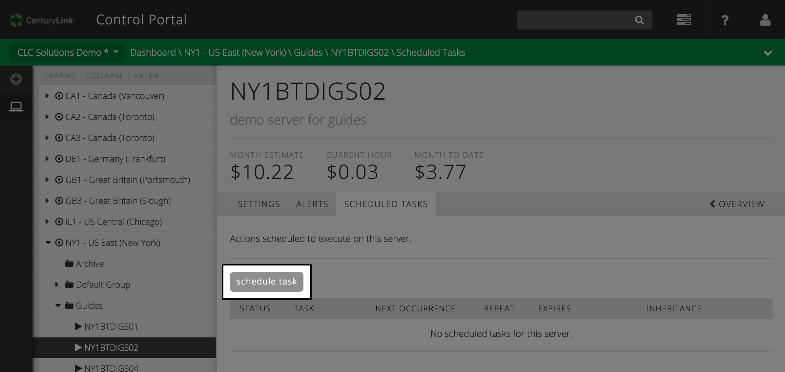
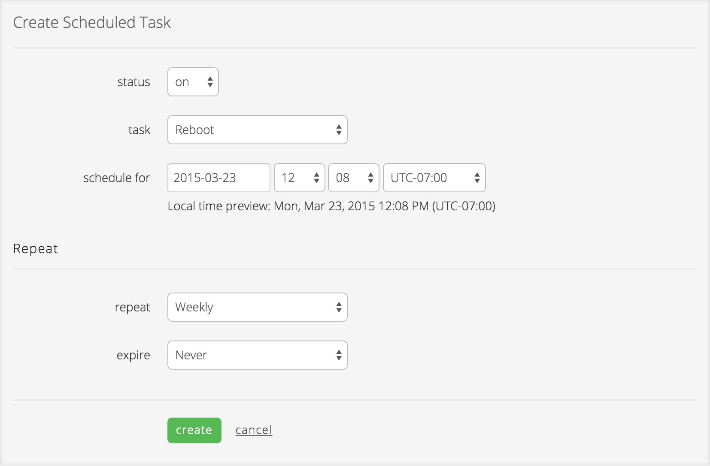
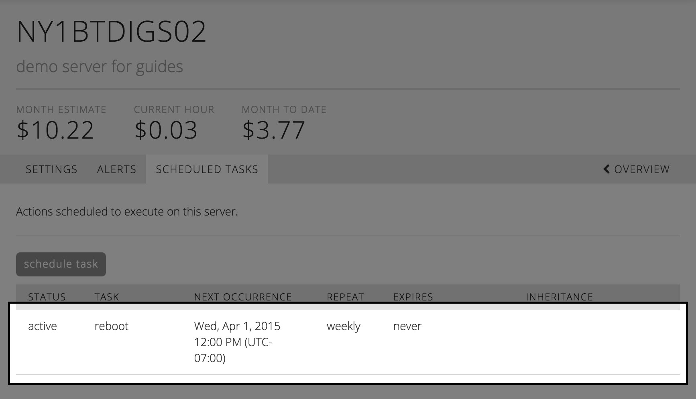

{{{
  "title": "Schedule a Task on a Server",
  "date": "04-04-2015",
  "author": "",
  "attachments": [],
  "related_products": [],
  "related_questions": [],
  "preview" : "Set tasks to run automatically at a scheduled point in time.",
  "thumbnail" : "../images/servers-schedule-task-preview.png",
  "contentIsHTML": false
}}}

<iframe width="560" height="315" src="https://www.youtube.com/embed/OhDD3MQGZa0?rel=0&amp;showinfo=0" frameborder="0" allowfullscreen></iframe>

### Introduction

Scheduled Tasks are used to set automated activities against cloud servers. This enables you to do things like coordinate maintenance activities, turn off developer/test servers over the weekend, or automatically delete or archive servers at the end of a project. This guide will walkthrough how to schedule a task on a single server, but scheduled tasks can also be set for server groups.

Once you've navigated to the server you wish to schedule a task for, select the **settings** item in the server power menu bar. Then select **scheduled tasks** to bring up the list of scheduled tasks for the server. Any previous tasks that have been scheduled, or scheduled tasks set at the servers parent group, will appear here.

On the scheduled tasks for the server, select the Schedule Task button to reveal the form to create a new schedule task.

Complete the form by selecting a task to execute and the date/time the task should be executed. If the task should be run more than once, you can set the task to repeat by selecting one of the following:

* Never (only occur once)
* Daily
* Weekly
* Monthly
* Weekly Custom. (select the day(s) of the week to run the task on)

For repeating tasks, you can set an optional expiration for the scheduled tasks after the task runs a certain number of times (**After Count**), or after a specified date (**After Date**).

Selecting the **create** button will apply the scheduled task to the server, and it will now appear on the list of scheduled tasks for the server. If you need to edit or delete the task, select the task in the list to open the edit form.

Congratulations, you’ve just scheduled a task to automatically run on a server on the CenturyLink Platform!
